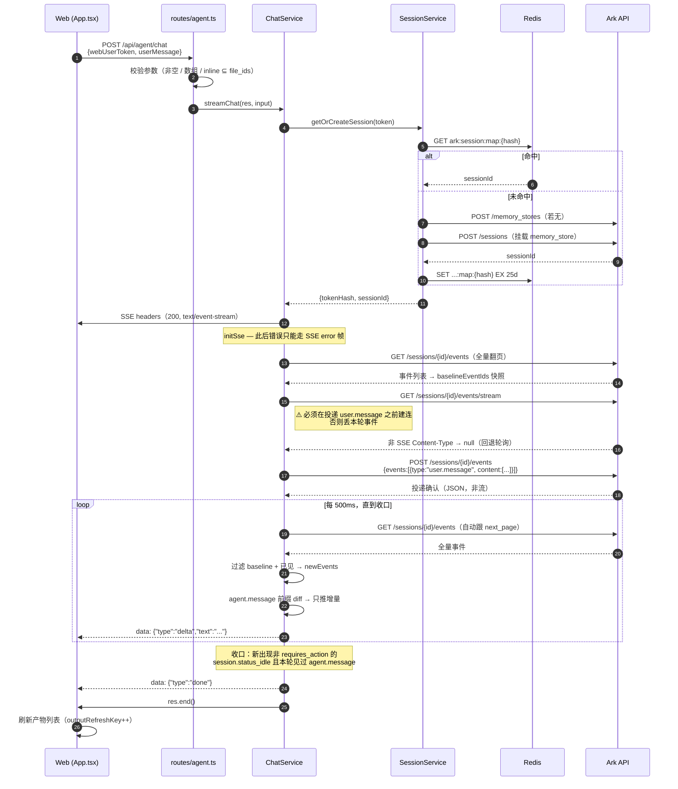
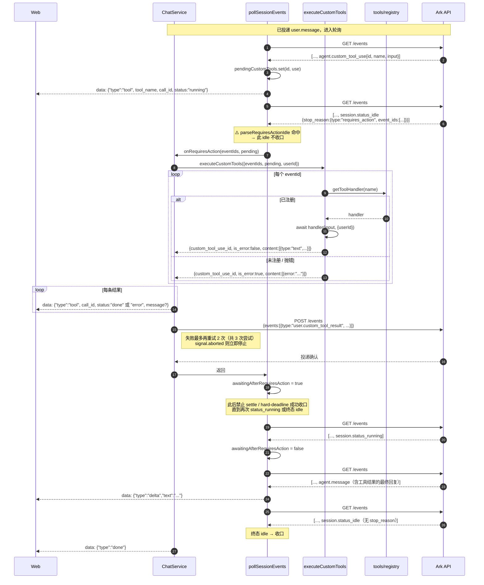
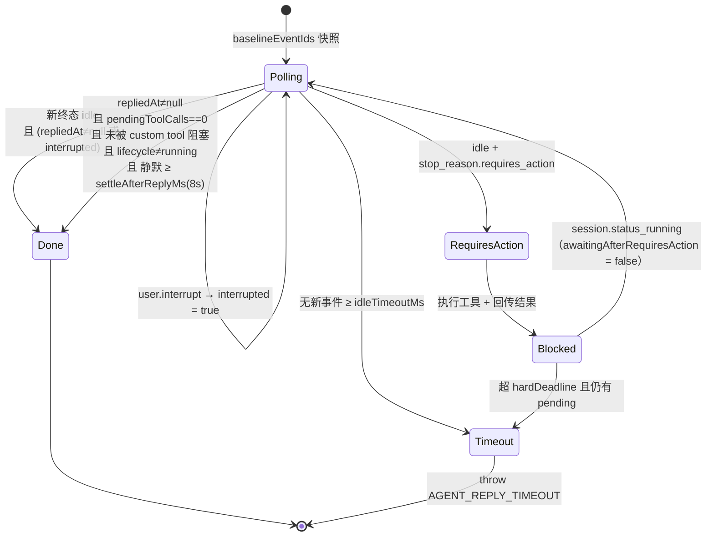
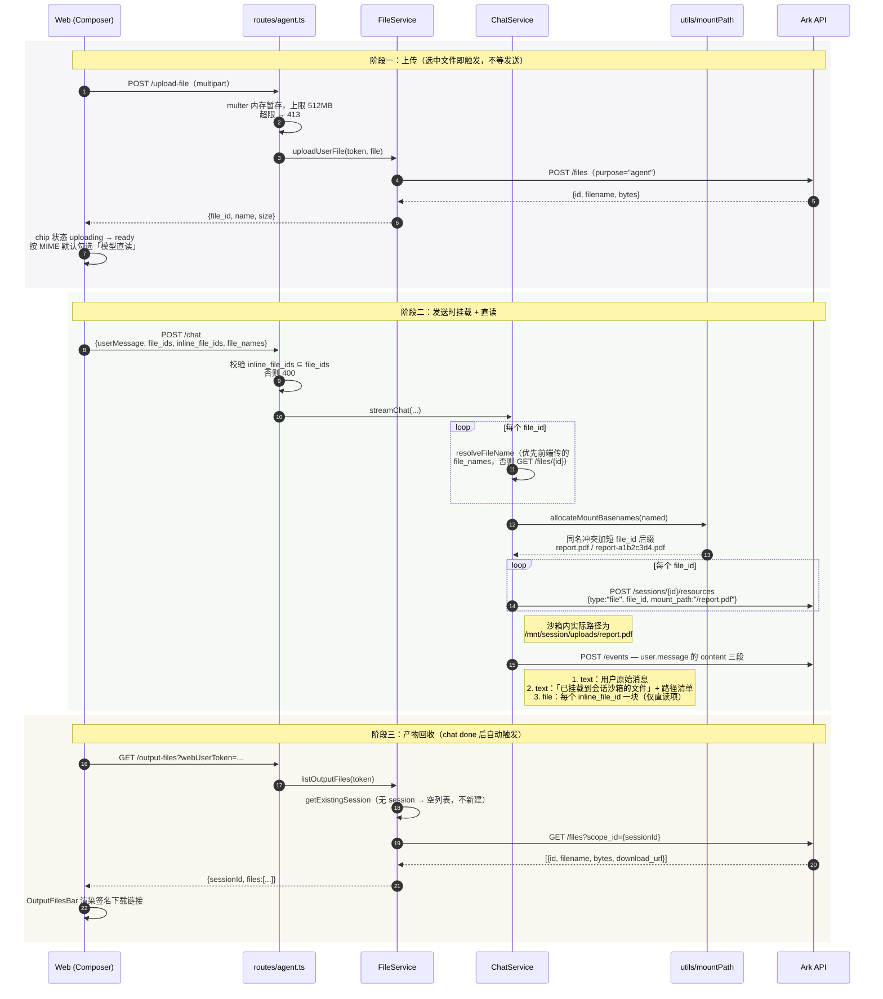
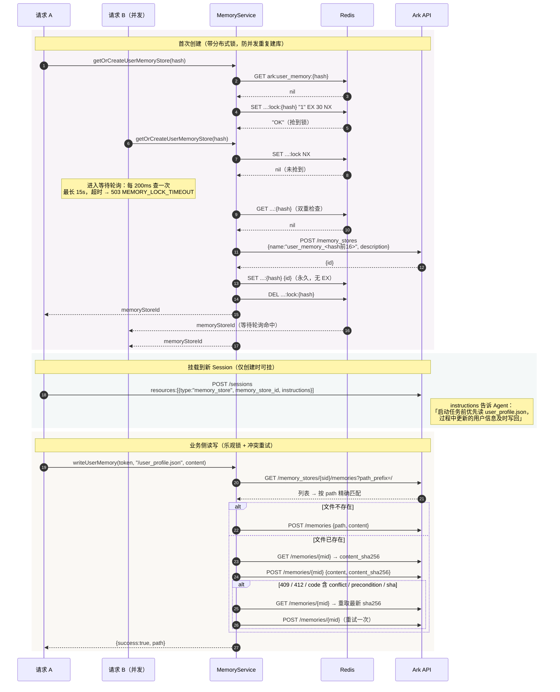
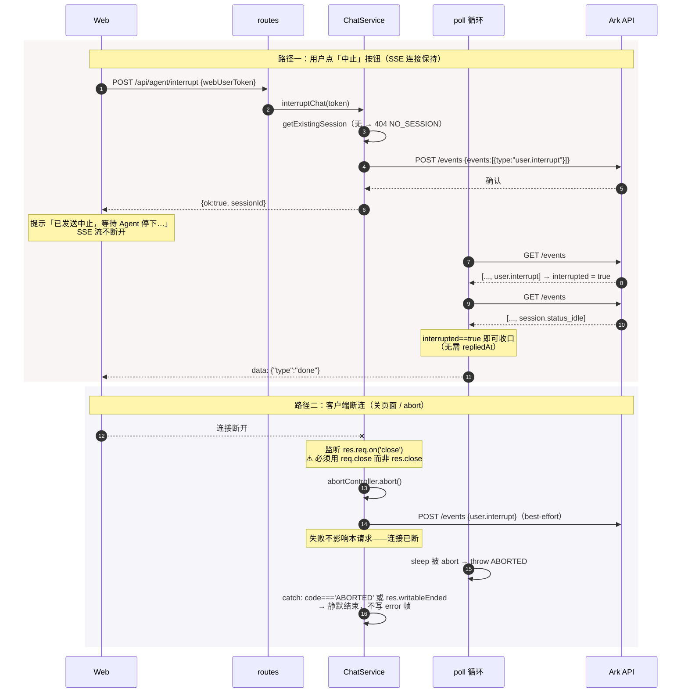
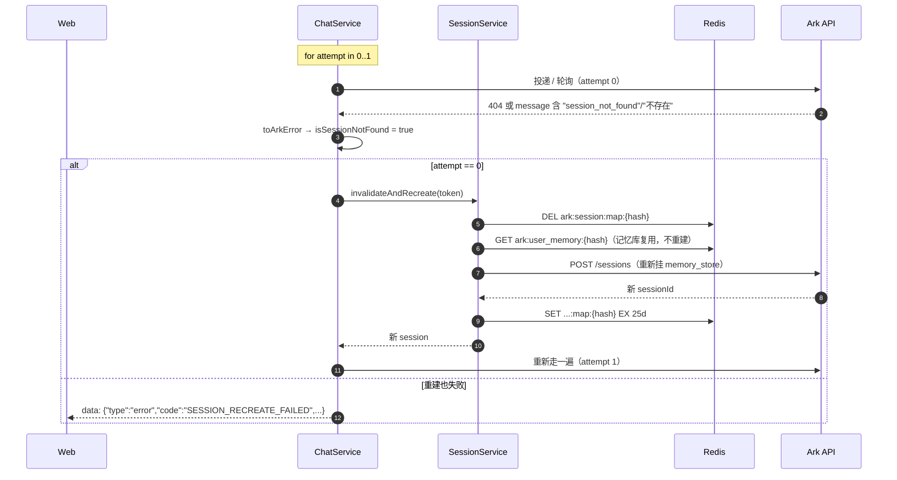

# 架构与功能说明

> 本文描述 **volcane-demo**（Ark Managed Agent Proxy）的整体架构、关键链路时序与已知约束。
> 面向需要接手、扩展或排障本服务的开发者。

---

## 1. 项目定位

本项目是**火山方舟（Ark）Managed Agent 的接入示范工程**：

- **后端**：Express 写的 HTTP 代理层，把浏览器请求翻译成方舟 Session API 调用，
  并把方舟的异构事件流归一化成 4 种 SSE 事件推给前端。
- **前端**：React + Vite 单页对话 UI，演示完整交互（流式对话、附件、产物、中止、工具状态）。

它封装掉了方舟 Managed Agent 接入中几块难啃的部分：

| 难点 | 封装位置 |
|------|----------|
| Session 生命周期与用户映射 | `services/sessionService.ts` + `store/sessionStore.ts` |
| 事件轮询的**收口判定**（何时算答完） | `utils/pollSessionEvents.ts` |
| Custom Tool 回环（`requires_action`） | `chatService` + `tools/` |
| 文件挂载、直读与产物回收 | `services/fileService.ts` + `utils/mountPath.ts` |
| 跨会话持久化用户记忆库 | `services/memoryService.ts` + `clients/arkMemoryClient.ts` |

---

## 2. 技术栈

| 层 | 技术 |
|---|---|
| 运行时 | Node.js 18+ / TypeScript (ESM, `"type": "module"`) |
| 后端框架 | Express 4 / axios / multer / cors |
| 状态存储 | Redis 7（ioredis），`docker-compose.yml` 一键起 |
| 前端 | React 18 / Vite 6 / 原生 `fetch` + `ReadableStream` |
| 测试 | Vitest（78 个单测，纯函数 + mock axios/redis，不需真实凭据） |
| 上游 | 火山方舟 `https://ark.cn-beijing.volces.com/api/v3` |

---

## 3. 分层架构

```
┌─────────────────────────────────────────────────────────┐
│  浏览器  web/  :5173                                     │
│  App.tsx（唯一状态中枢，无状态库）                        │
│    ├ TokenBar / MessageList / ToolStatusBar              │
│    ├ OutputFilesBar / Composer                           │
│    └ api.ts — fetch + ReadableStream 手解 SSE 帧          │
└───────────────────────┬─────────────────────────────────┘
                        │ vite proxy（timeout: 0）
┌───────────────────────▼─────────────────────────────────┐
│  Express  src/  :3000                                    │
│                                                          │
│  routes/agent.ts    参数校验 · HTTP 状态码映射            │
│         ↓                                                │
│  services/          业务编排                              │
│    ├ chatService    SSE 对话 · 工具回环 · session 重试     │
│    ├ sessionService getOrCreate / rebuild                │
│    ├ fileService    上传 / 产物列表                        │
│    └ memoryService  记忆库 getOrCreate / 读写              │
│         ↓                                                │
│  clients/           方舟 HTTP 封装                        │
│    ├ arkClient      sessions / events / files            │
│    └ arkMemoryClient memory_stores / memories            │
│  store/             Redis 映射                            │
│    ├ sessionStore   tokenHash → sessionId（TTL 25d）      │
│    └ memoryStore    tokenHash → memoryStoreId（永久）     │
│  utils/             事件解析 · 轮询状态机 · SSE · 挂载路径  │
│  tools/             Custom Tool 注册表 + 执行器            │
└───────────────────────┬─────────────────────────────────┘
                        │
┌───────────────────────▼─────────────────────────────────┐
│  火山方舟 Ark API                                         │
│  Sessions · Events · Files · Memory Stores               │
└─────────────────────────────────────────────────────────┘
```

**依赖方向严格单向**：`routes → services → clients/store → axios/redis`。
所有依赖通过构造函数注入，`src/server.ts` 是唯一的组装点，因此 service 层单测可完全脱离真实 Redis 与方舟。

---

## 4. 用户身份模型

前端只传一个 `webUserToken`（明文字符串，demo 默认 `demo-user`）。后端 `sha256` 成 `tokenHash`
（`src/utils/hash.ts`），作为一切的主键：

| Redis Key | 值 | TTL |
|---|---|---|
| `ark:session:map:<tokenHash>` | sessionId | 25 天 |
| `ark:user_memory:<tokenHash>` | memoryStoreId | **永久** |
| `ark:user_memory:lock:<tokenHash>` | `"1"` | 30 秒（创建锁） |

创建 Session 时注入沙箱环境变量：

```jsonc
{
  "agent": "<ARK_AGENT_ID>",
  "environment": {
    "type": "environment_with_overrides",
    "id": "<ARK_BASE_ENVIRONMENT_ID>",
    "config": { "env": {
      "USER_ID": "<tokenHash>",           // 哈希后的用户标识
      "USER_BEARER_TOKEN": "<原始 token>",
      "LEYO_AGENT_KEY": "<原始 token>"
    }}
  },
  "resources": [{ "type": "memory_store", "memory_store_id": "...", "instructions": "..." }]
}
```

`ARK_API_KEY` 只存在于服务端 `.env`，绝不下发前端。

---

## 5. 关键链路时序图

### 5.1 流式对话（无工具、无附件）

最基本的一条路：投递消息 → 轮询取回复 → 归一化推 SSE。



---

### 5.2 Custom Tool 回环（`requires_action`）

这是最复杂的一段。Agent 需要调本地工具时，会话会**中途进入 idle**——但这次 idle 不能收口。



> **路径说明**：Custom Tool 编排只挂在 `listSessionEvents` **轮询**路径。
> `tryStreamSessionEvents`（官方 SSE GET）本轮**未挂接**——若日后启用，需复用同一 `onRequiresAction` 回调。

---

### 5.3 收口判定状态机

`pollSessionEventsForAgentReply` 内部的状态与退出条件。这是全项目最微妙的一块。



**为什么需要这么复杂**（每条都是踩过的坑，代码注释里有对应记录）：

1. **一轮对话内每次模型请求都产生一条 `agent.message`** — 第一条不等于答完，
   会话仍 `session.status_running` 时不得收口。
2. **必须配对追踪 `tool_use` / `tool_result`**（含 `agent.mcp_tool_use` / `agent.mcp_tool_result` 变体），
   `pendingToolCalls > 0` 说明 Agent 还在跑工具。
3. **方舟有时给出回复后迟迟不发 `status_idle`** — 靠 `settleAfterReplyMs`（默认 8s 静默）兜底收口。
4. **同一 `agent.message` id 的内容会被后续轮询补全** — 用 `emittedTextById` 做前缀 diff，只推增量，
   否则前端会看到重复文本。
5. **长任务的结束事件常落在第二页以后** — `listSessionEvents` 自动跟 `next_page` 翻完
   （单页 200，最多 100 页）；只读首页会永远看不到结束，前端卡在「正在输入…」。
6. **`custom_tool_use` 不计入 `pendingToolCalls`** — 它走独立的 `pendingCustomTools` +
   `awaitingAfterRequiresAction` 双闸门。

---

### 5.4 文件交互：上传 → 挂载 → 直读 → 产物



**`file_ids` vs `inline_file_ids` 的区别：**

| | `file_ids` | `inline_file_ids` |
|---|---|---|
| 作用 | 挂载到会话沙箱 `/mnt/session/uploads/` | 作为 file content block 塞进消息 |
| Agent 如何用 | 用代码读文件（适合大文件、数据处理） | 模型直接「看」（适合图片、PDF 摘要） |
| 约束 | — | **必须是 `file_ids` 的子集** |
| 前端默认 | 全部附件 | 图片 / PDF / 文本 / Office 文档自动勾选 |

---

### 5.5 持久化记忆库（Memory Store）

关键约束：**memory_store 只能在创建 Session 时作为 `resources` 挂载，不能事后追加**。
所以记忆库的 getOrCreate 必须发生在 `createArkSession` 之前。



因为记忆库独立于 Session 且永久绑定 `tokenHash`，**`rebuild-session` 之后用户偏好仍然保留**——
这正是它与 Session 内上下文的本质区别。

---

### 5.6 中止（interrupt）与客户端断连

两条不同的路径，容易混淆：



> **为什么必须是 `req.close` 而非 `res.close`**（`src/services/chatService.ts` 注释）：
> `res.close` 在 SSE 场景下会误触发，导致轮询被 abort、前端收到 `EMPTY_STREAM`，
> 而方舟侧 Agent 仍继续跑完（控制台看得到 `agent.message`）。

---

### 5.7 Session 失效自动重建



注意：SSE header 在第一次 attempt **之前**就已发出（`initSse`），所以重建过程中的任何错误
都只能以 SSE `error` 帧下发，不能再改 HTTP 状态码。

---

## 6. API 契约

### HTTP 端点

| 方法 | 路径 | 请求 | 响应 |
|---|---|---|---|
| GET | `/health` | — | `{ok:true}`；前端每 12s 轮询 |
| POST | `/api/agent/chat` | `{webUserToken, userMessage, file_ids?, inline_file_ids?, file_names?}` | `text/event-stream` |
| POST | `/api/agent/interrupt` | `{webUserToken}` | `{ok:true, sessionId}`；无 session → 404 |
| POST | `/api/agent/rebuild-session` | `{webUserToken}` | `{ok:true, tokenHash, sessionId}` |
| POST | `/api/agent/upload-file` | multipart：`webUserToken` + `file` | `{file_id, name, size}`；超 512MB → 413 |
| GET | `/api/agent/output-files` | `?webUserToken=` | `{ok:true, sessionId, files:[{file_id,name,size,download_url}]}` |
| GET | `/api/agent/messages` | `?webUserToken=&limit=`（1–200，默认 50） | `{ok:true, sessionId, messages:[{id,role,content}]}` |
| GET | `/api/agent/memory` | `?webUserToken=&filePath=` | `{path, content, updated_at}`；不存在 → 404 |
| POST | `/api/agent/memory` | `{webUserToken, filePath?, content}` | `{success:true, path}` |

`filePath` 省略时默认 `/user_profile.json`；无前导 `/` 会自动补上。

### 归一化 SSE 事件

前后端各持一份对齐的联合类型：`src/types/sse.ts` ↔ `web/src/types.ts`。

```jsonc
{"type":"delta","text":"你好"}
{"type":"tool","tool_name":"get_user_order","call_id":"evt-1","status":"running"}
{"type":"tool","tool_name":"get_user_order","call_id":"evt-1","status":"error","message":"..."}
{"type":"error","code":"AGENT_REPLY_TIMEOUT","message":"..."}
{"type":"done"}
```

前端 `parseNormalizedEvent` 对不符合契约的 payload **直接丢弃**，不做兼容降级。

### 错误码

| code | 触发场景 |
|---|---|
| `ABORTED` | 客户端断连或主动 abort（前端静默忽略） |
| `AGENT_REPLY_TIMEOUT` | 无新事件超时 / 超总时限且仍有 pending |
| `SESSION_RECREATE_FAILED` | session 失效后重建也失败 |
| `NO_SESSION` | interrupt 时无活跃 session |
| `MEMORY_LOCK_TIMEOUT` | 等待他人创建记忆库超 15s |
| `MEMORY_NOT_FOUND` | 读取不存在的记忆文件 |
| `EMPTY_STREAM` | 前端侧：流正常结束但一个 delta 都没收到 |

---

## 7. 前端结构

`web/src/App.tsx`（340 行）是唯一状态中枢，无状态管理库。组件均为受控展示层：

| 组件 | 职责 |
|---|---|
| `TokenBar` | 切换 `webUserToken`（localStorage 持久化）、后端在线指示灯、重建会话按钮 |
| `MessageList` / `MessageItem` | 消息流渲染，含 `waiting` 打字态 |
| `ToolStatusBar` | Custom Tool 状态条，随 SSE `tool` 事件在 running → done/error 间切换 |
| `OutputFilesBar` | 产物列表，chat `done` 后由 `outputRefreshKey` 触发刷新 |
| `Composer` | 输入框 + 多文件上传 + 「模型直读」勾选 + 发送/中止按钮 |

几处值得注意的实现：

- **不能用 `EventSource`**（只支持 GET），改用 `fetch` + `ReadableStream`，手动 UTF-8 流式解码，
  按 `\n\n` 分帧（`web/src/api.ts`）。
- **切换 token 时**若正在流式输出，会 best-effort 向旧 session 发 interrupt，再 abort 本地请求。
- **历史消息拉取有 400ms debounce**，且 `streamingRef.current` 为真时跳过覆盖，避免打断进行中的流。
- **输入法保护**：`onKeyDown` 检查 `isComposing` / `keyCode === 229`，⌘/Ctrl+Enter 发送，Enter 换行。

---

## 8. Custom Tool 扩展方式

```ts
// src/tools/builtinTools.ts
registerToolHandler('my_tool', async (input, ctx) => {
  // input: Record<string, unknown>（来自 agent.custom_tool_use.input）
  // ctx.userId: 与创建 Session 时 USER_ID 一致的 tokenHash
  return { any: 'json-serializable value' };  // 自动 JSON.stringify 成 text content
});
```

两个前提：

1. **方舟控制台需为该 Agent 预先配置同名 Custom Tool**（含参数 schema），否则 Agent 不会调用。
2. 服务启动时 `registerBuiltinTools()` 会被调用（`src/server.ts`）。

内置 mock：`get_user_order`（参数 `order_id`）、`create_work_order`（参数 `title` / `content`）。

handler 抛错或工具未注册时，会以 `is_error: true` 回传给 Agent，**会话继续**，
Agent 通常能自行说明失败原因——这是刻意设计，不让单个工具失败拖垮整轮对话。

---

## 9. 已知约束与坑位

1. **同一 Session 禁止并发发消息** — MVP 未实现排队锁，并发写入会导致消息乱序或丢失。
   `user.interrupt` 是官方允许的例外，可在 Agent 执行中投递。
2. **环境变量仅在创建 Session 时注入，运行期不可改** — 修改 `.env` 后需 `rebuild-session`
   或等 Session 过期才生效。
3. **memory_store 不能事后追加** — 只能在 `POST /sessions` 的 `resources` 里挂载。
4. **必须监听 `req.close` 而非 `res.close`** — 见 5.6 节。
5. **全线关闭超时** — `server.requestTimeout/headersTimeout/timeout = 0`、axios `timeout: 0`、
   vite proxy `timeout/proxyTimeout: 0`。收口完全依赖 AbortSignal 与连接断开。
6. **`types` 查询参数必须重复传** — `?types=user.message&types=agent.message`；
   逗号拼接实测被方舟忽略（`src/utils/sessionHistory.ts`）。
7. **事件列表需翻页** — 默认只返回前 50 条，单页上限实测 200；长任务的结束事件常在第二页以后。
8. **`tryStreamSessionEvents` 未挂 Custom Tool 编排** — 目前上游多返回非 SSE 而回退轮询，
   若日后官方 SSE 可用，需补上 `onRequiresAction`。
9. **Token 刷新应主动 `rebuild-session`** — 保证映射与凭据一致。
10. **勿将 `ARK_API_KEY` 暴露给前端** — 前端只需 `webUserToken`。

`OPEN_ISSUES.md` 记录了首次对接时踩到的 4 个字段名/结构偏差（`agent_id` → `agent`、
environment 结构、events 数组包裹等），均已修复并通过真实 E2E 验证。

---

## 10. 本地开发

```bash
# 1. 起 Redis
docker compose up -d
# 若 Docker Hub 拉取失败，见 OPEN_ISSUES.md 的镜像源绕过方案

# 2. 配置凭据
cp .env.example .env
# 填 ARK_API_KEY / ARK_AGENT_ID / ARK_BASE_ENVIRONMENT_ID

# 3. 后端 :3000
npm install && npm run dev

# 4. 前端 :5173（另开终端）
cd web && npm install && npm run dev

# 5. 测试（不需要真实凭据）
npm test
```

生产构建：`npm run build && npm start`（后端）、`cd web && npm run build`（前端）。

### 目录索引

```
src/
├── server.ts              组装点：加载配置、注册工具、注入依赖、关超时
├── app.ts                 Express 装配：cors + json + /health + /api/agent
├── config.ts              环境变量校验与 AppConfig
├── routes/agent.ts        参数校验与 HTTP 状态码映射
├── services/
│   ├── chatService.ts     ★ SSE 对话编排、工具回环、session 重试
│   ├── sessionService.ts  getOrCreate / rebuild（内含记忆库挂载）
│   ├── fileService.ts     上传 / 产物列表
│   └── memoryService.ts   记忆库锁 + 乐观锁读写
├── clients/
│   ├── arkClient.ts       sessions / events / files（含请求体构造函数，便于单测）
│   └── arkMemoryClient.ts memory_stores / memories
├── store/                 Redis 映射（session / memory + 创建锁）
├── utils/
│   ├── pollSessionEvents.ts  ★ 收口判定状态机
│   ├── arkEventParser.ts     事件类型判定与文本提取
│   ├── sessionHistory.ts     历史窗口查询与时序反转
│   ├── streamArkEvents.ts    官方 SSE GET 消费（备用路径）
│   ├── mountPath.ts          挂载路径分配与同名去重
│   ├── memoryPath.ts / hash.ts / sse.ts
├── tools/                 注册表 + 执行器 + 内置 mock
└── types/                 ark.ts（上游契约）/ sse.ts（下游契约）

web/src/
├── App.tsx                状态中枢
├── api.ts                 ★ fetch + ReadableStream 手解 SSE
├── types.ts               与后端对齐的契约类型
└── components/            TokenBar / MessageList / ToolStatusBar
                           OutputFilesBar / Composer
```

★ 标记的是改动前值得先读完注释的文件。
