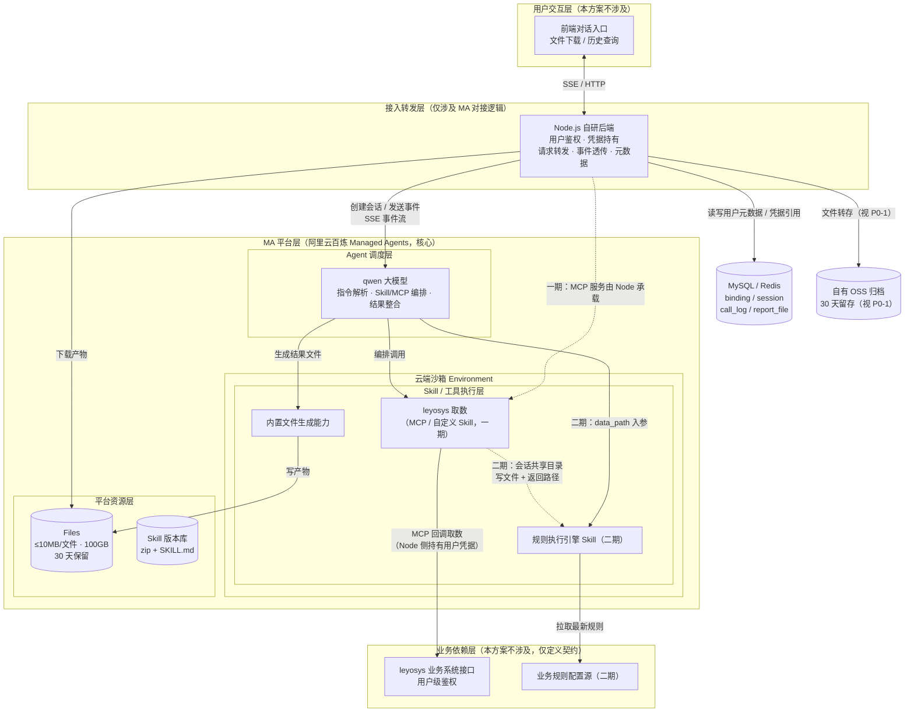

# 阿里云百炼 Managed Agents 商品异常分析 Agent 技术方案
> **版本**：V1.3（评审修订稿，结构对齐火山版 V1.3）
> **V1.3 修订**：① **一期不做分析（规则执行引擎）Skill**，诊断分析能力整体后移二期；一期链路为「指令理解 → leyosys 取数（MCP/回调，凭据由 Node 后端持有）→ 结果对话/文件交付」。② **明确多 Skill 大数据传递机制（见 3.1.3）**：大数据走**会话共享目录约定路径 + 路径入参**中转，完整数据不进模型上下文。
> **更新说明**：V1.1 修订：① 一期鉴权由「会话级环境变量注入」改为「Node 后端持有凭据 + MCP/回调取数」——百炼 agentstudio 公开 API 无 Vault/密钥库端点，也无火山 MA 的 `environment_with_overrides` 能力；② 长期记忆由平台 Memory Store 改为 Node 后端自建（百炼 agentstudio 无 Memory Store）；③ 修正 SSE 事件语义（`message` / `tool_call` / `mcp_call` / `session_status` / `tool_approval_*`）。仍保留：leyosys 用户级鉴权、规则全量热更新不中断会话、报告法定留存 30 天、单次单用户数据 ≤10MB、约 1000 名内部用户。
> **V1.2 修订**：新增 3.7 数据表结构设计（`business_user_agent_binding` / `business_agent_session` / `agent_call_log` / `agent_report_file` 四张表）；历史分析文件索引由 Node 后端元数据迁至 `agent_report_file` 表。
> **方案边界**：本方案仅覆盖阿里云百炼 Managed Agents（agentstudio）平台侧的对接设计、Agent/Environment/Session/Skill/MCP/Files 集成、资源管理、会话与事件处理，不包含 leyosys 业务系统本身、业务规则引擎的后端开发与运维。

---

## 怎么读本文档

- **先看「待确认项清单」**：P0 决定编码前必须敲定，P1/P2/P3 不影响主线通读。
- **再读「二、整体架构与核心链路」**建立全局；实现细节看三、四，可靠/安全/成本/运维按需看五~八，落地节奏看九。
- **阶段约定**：正文以「一期 / 二期」标注交付阶段；架构图中虚线表示二期能力。

## 待确认项清单（评审决策用 · 先读）
> 每项按「设计目的（解决什么问题）→ 为何待确认 → 需确认的因素」列出。**P0 不定不编码；P1 不挡编码、上线前必须验完；P2 为内部业务/商务确认，不阻塞技术开发；P3 属二期。**

### P0：编码前必须确定

#### P0-1 一期取数结果文件是否需要超出平台 Files 的 30 天留存（决定是否自有 OSS 归档）
- **设计目的**：百炼平台 Files 已提供 30 天保留期，但为硬删除、不支持归档、超期可能被清理；自有 OSS 转存解决的问题是「更可控的 30 天留存 + 历史回溯下载」。
- **为何待确认**：30 天的依据是「分析报告法定留存」，一期不做分析、产物是取数结果 Excel，该留存要求是否适用于取数文件尚未经合规确认；这直接决定一期要不要接自有 OSS 转存。
- **需确认的因素**：
  1. 合规/法务：取数结果文件是否属于法定留存范围、留存多久；
  2. 业务方：即便不法定，是否仍要求 N 天历史回溯下载，N 取多少；
  3. 结论为「平台 Files 30 天够用」→ 一期直接用平台 Files（产物发现/下载链路见 4.2），砍掉自有 OSS 转存与清理任务；结论为「需更长/更可控」→ 保留 3.5 自有 OSS 方案，并补验产物文件发现与 `GET /files/{id}/content` 下载链路。

#### P0-2 同一 Session 并发请求的处理策略
- **设计目的**：平台约束同一 Session 不能并发处理两条消息，后端必须决定用户在上一任务未结束时再发消息怎么办，防止平台报错或请求互相覆盖（3.2.1）。
- **为何待确认**：「排队」与「拒绝」对应两套完全不同的 Node 实现（队列+状态机+超时通知 vs 前置状态校验直接返回）和前端交互，属产品决策，不能由开发自行选择。
- **需确认的因素**：
  1. 产品取舍：排队等待（队列长度、排队超时、前端提示）还是直接拒绝（"上一任务进行中"）；
  2. 是否允许为同用户创建临时独立会话做并行分析（上下文不复用的代价是否接受）；
  3. 并发状态的落点：`business_agent_session.platform_status` + 行锁，还是 Redis 锁。

### P1：不挡编码，上线前必须验证（字段/事件映射级）

#### P1-1 模型 usage 字段结构与一轮累加口径（百炼事件名待核实）
- **设计目的**：一轮任务含 N 次模型请求，Node 需把 N 份 usage 累加为一行汇总落 `agent_call_log`，用于成本回算与账单对账（3.7.0）。
- **为何待确认**：百炼事件名与火山不同（无 `span.model_request_end`），事件体内 usage、request_id 的**准确字段名与层级**未以官方「会话事件流（SSE）」逐字核实；属映射层风险，不影响表结构。
- **需确认的因素**：
  1. usage 四字段的准确名称/层级（input/output/cache_read/cache_creation，如百炼口径不同则以官方为准）；
  2. request_id 字段位置，确认其是否为单次模型请求粒度（不落库、仅对账回查）；
  3. N 次累加的边界（以哪些事件界定一轮）。

#### P1-2 官方会话事件类型清单与产物文件发现链路复核
- **设计目的**：事件解析、任务收口（`session_status` + `stop_reason`，`requires_action` 不算结束）、工具/MCP 计数、错误归一化，以及产物文件的 session 维度发现方式（4.2）。
- **为何待确认**：当前事件名与语义来自公开文档与调研记录，非官方文档原文，需在编码对接前以官方「会话事件流（SSE）」逐字复核；产物文件如何按 Session 枚举 `file_id` 也需 POC 确认。
- **需确认的因素**：`message` / `tool_call` / `tool_call_output` / `mcp_call` / `mcp_call_output` / `tool_approval_*` / `session_status` / `error` 的字段与语义；`requires_action` 续跑方式；产物文件发现（`GET /files` 过滤口径）与 `GET /files/{id}/content` 下载链路。

### P2：内部业务/商务确认（不阻塞开发）

#### P2-1 `agent_call_log` 审计保留周期
- **设计目的**：确定审计表按月分区/归档策略与存储容量（3.7.6）。
- **为何待确认**：保留周期取决于财务对账与合规要求，技术侧不能自定。
- **需确认的因素**：保留月数（建议 ≥90 天）、是否按月分区、归档介质与查询方式。

#### P2-2 成本单价核对
- **设计目的**：7.1 月度成本测算作为立项/采购输入，数字不能是臆测值。
- **为何待确认**：运行时（0.5 元/小时，已核实）、qwen 模型 token、工具/MCP 调用、OSS 存储单价均需以官方价目页/购买页为准。
- **需确认的因素**：运行时现价、qwen 系列模型现价、工具/MCP 调用费标准、OSS 单价与生命周期费用。

#### P2-3 超时阈值取值与「超时」口径统一
- **设计目的**：既避免异常长任务空耗运行时，又不误杀正常的长耗时分析。
- **为何待确认**：已明确**等待 Agent 事件不设总超时、断线用 `GET /events` 分页补偿**；但 3.1.1「合理超时阈值」、5.1「超出运行阈值中断任务」措辞含糊，开发可能误加任务级总超时；取数分页的单次 HTTP 超时值也缺数据支撑。
- **需确认的因素**：
  1. leyosys 接口 P95/P99 响应时间 → 单次分页 HTTP 超时取值；
  2. 分页页数/数据量上限（与 ≤10MB、超限提示联动）；
  3. 是否保留任务级软超时（只告警/可中断，而非连接层硬超时），并据此统一 3.1.1、5.1 文字。

### P3：二期 POC（不挡一期）
1. 会话共享目录的挂载形态，以及接近 10MB 单文件的读写实测（3.1.3；百炼 Files 单文件 ≤10MB、挂载路径自动加 `/mnt/session/uploads` 前缀，多 Skill 共享可写目录形态待 POC）；
2. 百炼「密钥库」API 开放情况、凭据注入与运行期生效语义（3.4.2）。

---

## 一、项目概述
### 1.1 背景与目标
基于阿里云百炼 Managed Agents 构建商品异常分析智能 Agent，复用已开发完成的 leyosys 取数能力，结合可动态调整的业务分析规则，自动完成多维度商品异常诊断，输出结构化处理决策建议与分析报告，支撑业务人员高效定位问题、制定处置策略。

核心建设目标：
1.  复用 leyosys 取数能力，按用户维度鉴权调用业务接口，实现多源数据自动拉取与整合（一期凭据由 Node 后端持有，取数经 MCP/回调完成，沙箱不接触明文凭据）——**一期**
2.  取数结果分层交付：对话呈现 + 结构化结果文件——**一期**；异常诊断、规则匹配与业务分析规则热更新（规则调整无需重建沙箱、无需中断会话）——**二期**
3.  支撑约 1000 名内部业务用户稳定使用，单次单用户原始数据量 ≤10MB

### 1.2 建设范围
- ✅ 一期（本版落地）：Agent 编排设计、**leyosys 取数（MCP 或自定义 Skill）集成**、取数结果对话/文件交付、会话管理、Node 后端用户元数据与凭据、文件归档（自有 OSS，视 P0-1 决定是否接入）、SSE 事件对接、成本与运维设计。**一期不含分析/规则引擎 Skill**
- ⏭️ 二期（进阶）：**分析（规则执行引擎）Skill 与规则配置源热更新**（多 Skill 大数据按 3.1.3 会话共享目录模式接入）；密钥库/凭据托管（待官方 API，详见 3.4）；精细化权限、历史查询与归档管理
- ❌ 不包含：leyosys 业务系统开发、业务规则逻辑本身的研发、前端页面开发、业务侧后端服务

### 1.3 用户与使用模式
- 目标用户：约 1000 名内部业务运营/分析人员
- 触发方式：用户主动发送分析指令触发任务
- 交互形态：单轮完整分析 + 多轮追问细化（如调整维度、重算、补充说明）
- 鉴权粒度：leyosys 业务接口为**用户级独立鉴权**，每个用户凭据隔离；一期由 Node 后端持有凭据，取数经 MCP/回调完成，沙箱不接触明文凭据；二期视密钥库 API 开放情况升级
- 数据规模：单次单用户分析原始数据量 ≤10MB，沙箱内内存处理，不落地持久化

### 1.4 核心交付产物
1.  **一期**：取数结果对话呈现（数据摘要/明细）+ 结构化结果文件（Excel 等），平台 Files / 自有 OSS 归档，可历史追溯
2.  **二期**：对话式文字分析结论（异常类型、原因判断、处理建议、依据说明）与结构化分析报告文件（Markdown / Excel）

### 1.5 平台环境与版本说明
1. 百炼 Managed Agents 为 agentstudio 托管运行时，API 基地址 `https://{workspace_id}.cn-beijing.maas.aliyuncs.com/api/v1/agentstudio`，当前仅支持 `cn-beijing` 地域。
2. 扩展能力两类：①「自定义 Skill」——以 zip 包上传（≤10MB，根目录含 SKILL.md），在云端沙箱内执行，支持版本管理；②「MCP 服务」——接入外部工具服务，凭据由 MCP 服务自身管理。
3. 百炼 agentstudio 公开 API **无火山 MA 的 Vault/密钥库端点、无 Memory Store、无会话级环境变量注入（`environment_with_overrides`）、无 custom_tool 回调**；相关能力以 MCP / Node 后端自建替代。
4. 本方案默认按最低依赖路径设计（取数走 MCP/回调、元数据走 Node 后端、文件走平台 Files + 自有 OSS），确保 MVP 快速跑通。

---

## 二、整体架构与核心链路
### 2.1 总体架构分层
| 层级 | 说明 | 本方案范围 |
|---|---|---|
| 用户交互层 | 前端对话入口、文件下载与历史查询 | 不涉及 |
| 接入转发层 | Node.js 自研后端，负责用户鉴权、凭据持有、请求转发、事件透传、资源管理 | 仅涉及百炼 MA 对接相关逻辑 |
| **MA 平台层（核心）** | 阿里云百炼 Managed Agents 托管环境（agentstudio） | ✅ 本方案全覆盖 |
| 业务依赖层 | leyosys 业务系统接口、业务规则配置源 | 不涉及，仅定义对接契约 |

MA 平台层内部拆解：
- **Agent 调度层**：qwen 大模型推理、指令解析、多 Skill/MCP 编排调度、结果整合
- **Skill / 工具执行层**：leyosys 取数（MCP/自定义 Skill）、规则执行引擎 Skill（二期）、内置 bash/文件工具
- **基础资源层**：云端沙箱 Environment、Session、Files（≤10MB/文件、100GB/工作空间、30 天保留）、Skill 版本库；凭据一期由 Node 后端自持

**架构总览（组件与数据流视图）：**



### 2.2 核心 Skill / 工具分工与职责边界
| 能力 | 形态 | 职责 | 输入 | 输出 |
|---|---|---|---|---|
| leyosys 取数 | 自定义 Skill（zip+SKILL.md）或 MCP（一期） | 调用业务接口拉取商品数据并按用户隔离；凭据由 Node 后端持有，取数经 MCP/回调完成 | Agent 提取的业务查询参数（商品范围、时间维度等） | 一期：结构化结果回传 Agent + 结果文件导出；二期对接分析 Skill 时：大结果写会话共享目录、返回路径（见 3.1.3）。单用户单次 ≤10MB |
| 规则执行引擎（分析） | 自定义 Skill / MCP（二期，一期不建设） | 加载最新业务规则，执行规则匹配、异常分级、根因诊断 | **入参为取数写入共享目录的文件路径**（显式 path 入参）+ 动态规则数据 | 异常诊断结论、根因判断、决策建议、依据明细 |
| Agent 主模型 | 百炼托管大模型（qwen 系列） | 指令理解、参数提取、Skill/MCP 调度、结果整合、多轮对话；多 Skill 时传递共享目录路径 | 用户自然语言指令 | 最终文字回复、文件生成指令 |

> **形态说明（一期）**：leyosys 取数建议按 **MCP** 实现（Node 后端承载 MCP 服务、持有用户凭据），避免沙箱接触明文凭据；也可按自定义 Skill（zip+SKILL.md）实现，但一期因无会话级环境变量注入，取数仍需回调 Node/MCP 完成。规则执行引擎（二期）按自定义 Skill/MCP 实现，从业务侧规则接口拉取最新规则。

### 2.3 完整执行主流程
1.  用户发送自然语言分析指令（指定商品范围、时间、异常类型等）
2.  Node 后端校验用户身份，查询对应用户的会话与资源绑定关系
3.  Agent 解析指令，提取结构化查询参数
4.  **【一期】** 调度 leyosys 取数（MCP/回调，凭据由 Node 后端持有），使用当前用户独立凭据拉取对应维度的商品数据（≤10MB，内存处理；大结果导出文件）
5.  **【二期，一期不执行】** 取数将数据写入会话共享目录约定路径并返回路径（见 3.1.3）；Agent 把路径作为显式入参调度规则执行引擎 Skill，Skill 读文件、从业务侧规则配置源拉取全量最新规则（内存处理），执行异常诊断
6.  Agent 整合结果生成自然语言文字回复：一期为取数结果说明，二期为诊断结论与建议
7.  如需生成文件，调用文件生成能力输出结构化文件至沙箱产物目录；Node 后端按 P0-1 决定是否转存自有 OSS
8.  Node 后端异步更新用户元数据，并将结果文件写入 `agent_report_file` 表
9.  所有中间事件与最终结果通过 SSE 事件流推送至前端
10. 任务结束，会话进入 idle 状态，停止计费；原始数据随沙箱内存释放，不持久化留存（归档文件除外）

---

## 三、核心模块详细设计
### 3.1 自定义 Skill / MCP 集成设计
#### 3.1.1 leyosys 取数
- **部署形态（二选一，MVP 建议 MCP）**：
  - **MCP 形态**：将 leyosys 取数封装为自定义 MCP 服务（由 Node 后端承载），Agent 通过 `mcp_servers` 引用；执行与凭据管理在 MCP 服务侧完成
  - **Skill 形态**：自定义 Skill（zip ≤10MB，根目录 SKILL.md），挂载到 Agent 时锁定版本；Skill 在云端沙箱内执行、经回调取数
- **鉴权方式（一期）**：百炼 agentstudio 公开 API 无 Vault/密钥库端点、无会话级环境变量注入能力；落地为 **Node 后端持有用户凭据，取数经 MCP/回调完成**，沙箱不直接接触明文凭据
- **二期演进**：若官方后续开放「密钥库/环境变量注入」，可迁移为 Skill 沙箱内读取注入凭据直连业务接口（见 3.4.2）
- **数据处理策略**：
  - 单次单用户原始数据量 ≤10MB，沙箱内存可承载，数据全程在内存中流转处理
  - 不写入沙箱本地持久化文件，避免 IO 开销与数据残留
  - 任务结束后数据随上下文释放，沙箱销毁后完全清除，符合数据安全要求
- **用户隔离**：不同用户凭据由 Node 后端隔离，会话与沙箱完全隔离，无交叉访问风险
- **超时配置**：配置合理超时阈值，避免长耗时接口占用沙箱时长
- **错误约定**：标准化错误码与错误信息，Agent 可根据错误类型给出对应话术

#### 3.1.2 分析规则热更新设计（**二期，随分析 Skill 一起上线；一期不建设**）
##### 设计原则：执行器与规则数据解耦，全量热更新不中断会话
- **规则执行引擎 Skill**：作为稳定的执行器本体，封装规则解析、匹配、计算逻辑，版本迭代频率低
- **规则数据**：独立于 Skill 包，由业务侧集中维护与更新，业务调整即时生效

##### 规则存储与加载方案
采用 **业务侧规则配置源实时拉取** 方案（规则不存平台侧），兼顾热更新与按用户隔离：
1.  **存储位置**：规则数据独立于 Skill 包，由业务侧规则配置源统一维护版本，不写入百炼 Files / 记忆
2.  **加载方式**：规则执行引擎 Skill 每次执行时，直接调用业务侧规则接口拉取最新全量规则（内存处理，不落地）
3.  **生效时机**：**无需重建沙箱、无需中断在线会话**，每次执行拉最新，全量用户即时生效
4.  **版本管理**：规则带版本号，业务侧保留最近 3 个历史版本；回滚在业务侧配置源完成，Skill 下次执行自然拉取回滚后版本
5.  **降级兜底**：规则接口加载异常时，按 5.1 重试；仍失败则返回明确错误提示，引导用户稍后重试，避免用错误规则产出结论

#### 3.1.3 Skill 间协作机制（一期单能力；多 Skill 大数据走会话共享目录）

**一期**：只上线 leyosys 取数，无 Skill 间数据传递；Agent 提取参数 → 调取数（MCP/回调）→ 结果对话交付/文件导出。

> **二期接入分析 Skill 时的大数据传递机制（设计目标，待 POC 验证）**：
>
> 1. **约束**：同会话多 Skill 之间**不能直接跨沙箱共享本地文件**（各自执行环境的本地文件系统不互通），也不能编程互调，只能由 Agent 编排；
> 2. **禁止**：把完整结果集放进工具返回值经模型上下文传递——10MB 量级（数百万 token）物理上无法过模型；
> 3. **机制：会话共享目录 + 路径参数**：
>    1. 取数把结果写入**会话共享目录**的约定路径（如 `/{shared_root}/{task_id}/raw_{接口标识}.{jsonl|xlsx}`，`task_id` 由取数自行生成（如 uuid），路径规范在 Skill/MCP 契约中固化，格式与分析 Skill 的读取契约对齐）
>    2. 取数的返回值只放小载荷：**路径 + 行数/字段/字节数/摘要**
>    3. Agent 取到该路径后，将其作为**显式入参**传给分析 Skill；**分析 Skill 必须定义路径入参（如 `data_path`）来接收并读文件**，不得自行扫目录或猜路径
>    4. 分析 Skill 读文件后在其进程内完成诊断，只把结论返回给 Agent，数据不进模型上下文
> 4. **安全**：路径由 Skill 生成、不由用户输入决定；分析 Skill 对入参路径做前缀校验（必须在共享目录约定前缀内），防路径穿越
> 5. **生命周期**：共享目录文件随会话沙箱生命周期，**不作长期留存**；需 30 天留存的报告/结果另行转存（见 3.5），二者职责分开
> 6. **异常**：路径不存在、格式不符或越权 → 分析 Skill 返回标准化错误，由 Agent 重新调取数或告知用户；分析 Skill 自身失败则终止诊断，取数文件保留
>
> 【一期不触发】上述机制随二期分析 Skill 验证落地。百炼 Files 挂载路径会自动加 `/mnt/session/uploads` 前缀，且单文件 ≤10MB；「会话共享目录」的具体挂载形态与接近 10MB 单文件读写需 POC 确认（见待确认项 P3-1）。

- 调度模式（二期）：取数 → 路径传递 → 分析，由 Agent 串行编排
- 数据传递：**路径/摘要过模型，完整数据走共享目录文件，不过模型上下文**
- 异常中断：取数失败不再调分析；分析失败则诊断终止，已取数据与归档文件保留

### 3.2 会话管理设计
#### 3.2.1 会话复用策略
- **策略**：**一人一会话（one user one session）**，1000 用户对应约 1000 个常驻 Session
- **理由**：
  1.  用户主动触发、多轮追问场景多，复用会话保留上下文，提升交互连贯性
  2.  资源（Files、Environment）一次创建/挂载，全程复用，避免重复创建开销
  3.  会话处于 idle 不计运行时费，闲置用户不产生运行成本
  4.  规则热更新不依赖会话重建，会话长期在线不影响规则生效
- **快照语义**：创建 Session 时服务端**快照当时的 Agent 配置**，后续更新 Agent 不影响已有会话
- **边界**：同一用户多次分析复用同一会话，不同用户会话完全隔离，数据不互通
- **并发限制**：同一 Session 不支持并发发送两条消息（平台约束）。同一用户并发的分析请求需由后端排队或拒绝（返回"上一任务进行中"），避免第二个请求覆盖或报错；如需并行分析，需为该用户创建临时独立会话，代价是上下文不复用

#### 3.2.2 交互模式与状态机
- 支持单轮一次性完整分析
- 支持多轮追问：调整分析维度、细化品类、重新计算、补充说明建议
- 上下文保留在平台会话事件流中，无需业务侧存储

| 状态 | 含义 | 可执行操作 |
|---|---|---|
| `idle`（`stop_reason=null` / `end_turn` / `retries_exhausted`） | 可交互空闲 | 发送新消息、挂载文件、归档/删除 |
| `idle`（`stop_reason=requires_action`） | 存在 always_ask 工具审批待裁决 | 提交审批或中断，**不能用普通消息继续** |
| `running` | 处理中 | 中断 |
| `terminated` | 归档/删除/不可恢复错误 | 查看历史，新建会话继续 |

#### 3.2.3 中断与审批
- 长耗时分析过程中，支持通过 `interrupt` 事件中止当前任务
- 中断仅终止当前执行轮次，不销毁沙箱、不删除会话，后续可继续发起新分析
- 对高风险写操作可将工具配置为 `always_ask`，触发 `tool_approval_request` → `idle(requires_action)` → 提交 `tool_approval_response` 裁决后继续

### 3.3 用户级元数据与长期记忆设计
> 与火山 MA 的关键差异：百炼 Managed Agents 的 agentstudio API **未提供火山 MA 那样的「Memory Store」资源**；长期记忆在百炼是独立的「记忆库」产品（面向智能体应用，需另评估是否接入）。本方案一期不依赖平台侧 Memory Store，用户级元数据由 Node 后端自建存储。

#### 3.3.1 存储内容清单
| 存储项 | 说明 | 位置 | 更新方 |
|---|---|---|---|
| 用户分析偏好 | 常用分析维度、默认时间范围、输出格式偏好、默认品类权限 | Node 后端（Redis/DB） | Node 后端 |
| 历史分析文件索引 | 已迁至 `agent_report_file` 表（见 3.7.4），不再放元数据单条 JSON | Node 后端 DB | Node 后端 |
| 用户权限标识 | 可访问的商品品类、数据范围权限标记 | Node 后端（Redis/DB） | Node 后端 |

> **不存储**：原始业务明细数据、完整异常清单、规则执行引擎代码、全局业务规则（规则由业务侧配置源承载，见 3.1.2）

#### 3.3.2 读写策略
- 用户级元数据统一由 Node 后端读写，Skill/MCP 不直接写，避免数据篡改
- 更新时机：用户配置变更、完成新的分析任务时，由后端异步更新对应用户的元数据

#### 3.3.3 容量与生命周期
- 自建存储自行约束，不依赖平台 2000 条/库等限制
- 文件索引由 `agent_report_file` 表承载，与归档文件生命周期同步（30 天），到期同步清理（见 3.7.6）
- 规则数据生命周期由业务侧配置源管理（保留最近 3 版），与本存储解耦

### 3.4 凭据管理设计（一期：Node 后端持有；二期：密钥库待官方 API）
#### 3.4.1 一期方案（本版落地）
- **事实依据**：百炼 agentstudio 公开 API 总览仅列 Agent / Environment / Session / Event / Files / Skill，**无 Vault/密钥库端点，也无火山 MA 的 `environment_with_overrides` 会话级注入能力**；控制台会话页虽有「密钥库」标签页，但截至本版未开放对应 API。
- **落地方式**：用户凭据由 Node 自研后端统一持有，leyosys 取数封装为 **MCP 服务或 Node 回调**完成，沙箱内不接触用户明文凭据。
- **鉴权链路**：前端 → Node 校验用户身份 → 由 Node/MCP 侧以该用户凭据调用 leyosys → 结果返回 Agent。每个用户凭据隔离，互不可见。
- **安全边界**：后端不向前端暴露凭据；日志、SSE 事件流、Agent 消息不打印完整凭据；凭据支持定期轮换并留存审计。

#### 3.4.2 二期进阶：密钥库 / 凭据托管（待官方 API）
> 一期不采用密钥库，原因：百炼「密钥库」为控制台能力，对应 API 截至本版未开放，不能作为技术结论写死。
- **目标**：若官方后续开放「密钥库」API 与按会话注入能力，则升级为**一用户一凭据（库）**，Skill 沙箱内读取注入凭据直连业务接口，与火山 Vault 方案对齐。
- **上线前待核实项**：凭据创建/更新 API、是否运行期生效、注入与读取机制，均须以官方文档/POC 为准。
- **隔离性**：不同用户凭据完全隔离，会话之间不互通。

#### 3.4.3 资源绑定关系
通过业务映射表维护（详见 3.7）：
- `business_user_agent_binding`：`user_id ↔ credential_ref`（Node 后端凭据引用，不存明文）
- `business_agent_session`：`user_id ↔ platform_session_id`，默认会话以 `is_default=1` 标识

### 3.5 文件 30 天归档存储设计
#### 3.5.1 存储方案选型
- 百炼 Managed Agents 的 Files 已核实配额：**单文件 ≤10MB、工作空间总容量 100GB、保留期 30 天（超期可能被自动清理）**；文件仅支持硬删除、不支持归档，删除后不可恢复。
- 挂载规则已核实：创建 Session 时在 `resources[]` 指定 `file_id` 与 `mount_path`；运行时可通过 `POST /sessions/{session_id}/resources` 追加挂载；填写的 `mount_path` 会被平台自动加上 `/mnt/session/uploads` 前缀（如 `/workspace/report.xlsx` 实际为 `/mnt/session/uploads/workspace/report.xlsx`）。挂载时服务端做内部拷贝并生成 session 级 `file_id`，原始文件不受会话内修改影响。
- 报告产物由 Agent 写入沙箱产物目录后，Node 后端通过 `GET /files/{file_id}/content` 拉取；若 P0-1 结论需更可控的 30 天留存，则**转存到自有 OSS 桶**实现历史追溯（平台 Files 硬删除、不支持归档，不建议作为唯一归档介质）。

> **是否必须自有 OSS（待确认，见「待确认项清单」P0-1）**：平台 Files 本身已 30 天保留，但硬删除不可恢复。若合规确认取数结果文件只需平台 30 天且无需长期回溯，则一期直接用平台 Files（砍掉 OSS 转存与清理任务）；若需更可控留存，则保留本方案，并补验产物文件发现与下载链路。

#### 3.5.2 目录与命名规范
- 按用户分目录：`/archive/{biz_user_id}/year/month/`
- 文件命名：`{分析类型}_{商品范围}_{时间}_{任务ID}.xlsx/md`
- 索引关联：文件归档后，将路径、大小、时间写入 `agent_report_file` 表，支持前端查询与下载

#### 3.5.3 生命周期与成本
- 报告自生成之日起标准存储 30 天，到期自动删除，同步清理索引
- 容量测算：单份报告约 200KB，1000 用户日均 1 份，30 天留存总量约 6GB；OSS 存储单价以官方 OSS 定价为准

### 3.6 规则内聚与功能解耦设计
#### 3.6.1 核心设计原则
严守两条设计红线：
1. **不修改 Agent 原始主提示词**：主提示词仅保留角色定位、行为边界与工具调用总原则，不写入具体业务规则、判定标准与映射逻辑，保持长期稳定。
2. **不篡改用户原始输入**：用户自然语言输入原样透传，不在后端强行拼接参数或补充内部信息，保证对话历史一致性。

所有业务规则、执行逻辑、实体映射能力全部下沉至 Skill/MCP 层，兼顾保密性与独立迭代能力。

#### 3.6.2 规则分层承载
按规则性质分层落地，兼顾保密、稳定与灵活性：

| 规则层级 | 承载形态 | 更新方式 | 迭代频率 |
|---|---|---|---|
| 框架层（行为边界、输出总规范） | 极简系统主提示词 | Agent 配置变更 | 极低 |
| 执行层（分析流程、判定逻辑、方法论） | 分析引擎自定义 Skill/MCP | Skill 包版本发布 | 中 |
| 数据层（阈值、分级标准、商品映射） | Skill 内部配置 / Node 后端加密存储 | Skill 内更新 / 后端热更新 | 高 |

核心业务规则全部内聚于 Skill/MCP 内部，控制台仅可见 Skill 名称与功能描述，满足高保密要求。

#### 3.6.3 功能解耦与工具拆分
按单一职责原则拆分，功能边界清晰，独立迭代、可复用：
- **leyosys 取数（一期）**：业务接口数据拉取，凭据由 Node 后端持有，按用户隔离
- **报告/结果文件生成（一期）**：结构化结果文件输出、格式转换
- **商品信息标准化工具（二期可拆）**：商品名称/别名转标准编码、属性映射与权限校验，基础能力复用
- **分析引擎（二期）**：规则加载、异常诊断、决策生成，核心业务逻辑唯一承载点；经会话共享目录 `data_path` 入参接收取数结果（见 3.1.3）

二期工具间采用模型统一编排、串行调度模式，**大数据走共享目录文件、路径过模型**，职责边界清晰。

#### 3.6.4 工具调用管控机制
采用「模型自主调度 + 后端边界约束 + 入口校验 + 事件观测兜底」机制，既保留 Agent 原生编排能力，又尽量确保分析类任务触发工具。
1. **Agent 工具配置**：取数/分析能力通过 `tools` / `mcp_servers` 注入 Agent 自定义工具列表，由 Agent 自主识别意图、选择工具。
2. **入口合法性校验**：所有业务工具入口做参数与权限校验，校验不通过返回标准化错误，禁止跳过执行。
3. **事件流观测兜底**：SSE 层观测本轮工具调用事件（`tool_call` / `mcp_call`，成对下发）；若分析类请求至 idle 仍无工具调用记录，**不自动重发消息**，仅记录异常并提示用户重试，避免重复取数、重复计费与重复产物。
4. **待核实**：百炼是否提供强制工具调用参数（火山 `tool_choice` 的等价物）需以官方文档为准；MVP 阶段先以 Agent 配置 tools + system prompt 引导为主。

#### 3.6.5 分阶段落地
1. **一期（快速上线）**：只建取数链路——leyosys 取数（MCP/回调）+ 结果对话/文件交付 + 会话/凭据/元数据/归档对接，最小开发量跑通全链路。
2. **二期（分析能力）**：建设分析引擎 Skill 与规则配置源，按 3.1.3 会话共享目录模式接入取数结果；商品标准化等基础能力按需拆出。
3. **三期（动态优化）**：高频规则抽离至 Node 后端加密存储，支持热更新。

### 3.7 数据表结构设计（评审修订稿）
> 设计口径：
> 1. `agent_call_log` 的「一次调用」指**一轮完整分析任务**（一次用户消息触发到本轮回到 idle），不是单次模型/工具请求；否则 Token、时长、工具次数会碎片化，无法对齐计费口径。
> 2. 审计表只存统计维度，不存消息正文、原始业务明细、规则内容。
> 3. 用户偏好、权限标识放 Node 后端 Redis/DB（百炼无 Memory Store）；**历史文件索引改由 DB 承载**（见 `agent_report_file`），避免单条 JSON 膨胀与列表查询困难。
> 4. 时间统一用 `DATETIME(3)` 保留毫秒，便于按运行时长与断线补偿对账。

#### 3.7.0 字段数据来源核对（依赖百炼返回的字段）
| 字段 | 数据来源 | 百炼是否直接提供 | 说明 |
|---|---|---|---|
| platform_session_id | `POST /sessions` 返回的 `id` | ✅ 直接返回 | 4.1 已确认 |
| platform_status / stop_reason | `session_status` 事件 + `GET /sessions/{id}` | ✅ 直接返回 | 4.2 已确认；stop_reason 为 null / end_turn / retries_exhausted / requires_action |
| agent_id / agent_version | 创建、查询会话返回 | ✅ 直接返回（待核实） | 会话创建时快照 Agent 配置，创建后不变，落 `business_agent_session.agent_version` |
| tool_call_count | 事件流中的 `tool_call` / `mcp_call` 事件 | ✅ 直接返回（待核实） | 平台逐次、成对下发；Node 按本轮事件对计数，只落本轮汇总数，不存工具明细 |
| input_tokens / output_tokens / cache_read_tokens / cache_creation_tokens | 百炼 usage（事件/接口） | ⚠️ 待核实 | 百炼事件名与火山不同，usage 字段名/层级须以官方「会话事件流（SSE）」为准（见待确认项 P1-1）；一轮内每次模型请求分别返回，Node 需累加后只落一行汇总 |
| running_duration_ms | 后端观察 running → idle 自行计时 | ❌ 平台不直接给单次时长 | 由 started_at / ended_at 计算，可靠 |
| cost | 后端按官方单价回算 | ❌ 平台不直接给单次费用 | 由 token / 时长 / 工具/MCP 次数计算，不得采信模型返回值 |
| model | 业务侧创建 Agent 时指定，或事件返回 | ✅ 业务侧已知 | 若会话可覆写模型，需记录覆写后的值 |
| error_code / error_msg | `error` 事件（顶层 error.code / error.message） | ⚠️ 事件归一化 | 4.2 已注明 error 为归一化口径 |
| file_id / 文件归属 | `GET /files` 枚举 + `GET /files/{id}/content` 下载（待核实发现口径） | ⚠️ 待核实 | 产物文件如何按 Session 枚举 `file_id` 需 POC 确认（见待确认项 P1-2）；是否再转存自有 OSS 取决于 P0-1 |

#### 3.7.1 business_user_agent_binding（业务用户-平台资源绑定，用户级）
对应 3.4.3 原 `user_agent_bind` 的落表，解决「创建会话前需知道该用户的凭据引用」的引导问题。

| 字段 | 类型 | 说明 | 必填 |
|---|---|---|---|
| id | BIGINT | 自增主键 | 是 |
| user_id | VARCHAR(64) | 业务用户 ID（唯一） | 是 |
| credential_ref | VARCHAR(128) | Node 后端用户凭据引用（不存明文） | 是 |
| status | TINYINT | 0 正常 / 1 停用 | 是 |
| created_at | DATETIME(3) | 创建时间 | 是 |
| updated_at | DATETIME(3) | 更新时间 | 是 |

约束/索引：`UNIQUE(user_id)`。默认会话不落这张表，由 `business_agent_session.is_default=1` 判定，避免双写不一致。

#### 3.7.2 business_agent_session（业务会话映射，会话级）
| 字段 | 类型 | 说明 | 必填 |
|---|---|---|---|
| id | BIGINT | 自增主键 | 是 |
| user_id | VARCHAR(64) | 业务用户 ID | 是 |
| platform_session_id | VARCHAR(128) | 百炼 Session ID（唯一） | 是 |
| agent_id | VARCHAR(128) | 创建会话时的 Agent 实例 ID | 否 |
| agent_version | VARCHAR(32) | Agent 版本号（会话创建后全程不变） | 否 |
| is_default | TINYINT | 1 默认会话 / 0 临时会话 | 是 |
| platform_status | VARCHAR(32) | 百炼状态：idle / running / terminated | 是 |
| biz_status | TINYINT | 0 活跃 / 1 已结束（terminated 时置 1） | 是 |
| title | VARCHAR(255) | 会话标题/摘要 | 否 |
| credential_version | VARCHAR(64) | 本次使用的 Node 凭据版本（轮换重建用） | 否 |
| created_at | DATETIME(3) | 创建时间 | 是 |
| last_active_at | DATETIME(3) | 最后活跃时间 | 是 |
| terminated_at | DATETIME(3) | 终止时间 | 否 |

约束/索引：`UNIQUE(platform_session_id)`；`INDEX(user_id)`；「每用户唯一默认会话」由应用层保证 `is_default=1` 唯一。保留 `platform_status` 与 `biz_status` 两层：平台状态用于对接事件流，业务状态用于前端展示与清理。

#### 3.7.3 agent_call_log（调用审计，一次分析任务一行）
| 字段 | 类型 | 说明 | 必填 |
|---|---|---|---|
| id | BIGINT | 自增主键（一轮任务一个，作为审计与文件关联的唯一标识） | 是 |
| user_id | VARCHAR(64) | 业务用户 ID | 是 |
| session_id | VARCHAR(128) | 百炼 Session ID | 是 |
| agent_id | VARCHAR(128) | Agent 实例 ID | 否 |
| model | VARCHAR(64) | 模型标识（如 qwen-plus） | 否 |
| status | TINYINT | 0 成功 / 1 失败 | 是 |
| error_code | VARCHAR(64) | 错误码 | 否 |
| error_msg | VARCHAR(512) | 错误信息 | 否 |
| input_tokens | INT | 未命中缓存的新增输入 Token（计费输入项） | 否 |
| output_tokens | INT | 模型生成的全部输出 Token（计费输出项） | 否 |
| cache_read_tokens | INT | 命中缓存读取 Token（单价更低） | 否 |
| cache_creation_tokens | INT | 新增创建缓存 Token（缓存存储计费，可选） | 否 |
| total_tokens | INT | 总消耗 Token（`input_tokens + output_tokens + cache_read_tokens`） | 否 |
| tool_call_count | INT | 工具/MCP 调用次数（`tool_call` + `mcp_call`） | 否 |
| running_duration_ms | INT | 运行时长（毫秒） | 否 |
| cost | DECIMAL(12,6) | 折算费用（后算，可空） | 否 |
| started_at | DATETIME(3) | 开始时间 | 是 |
| ended_at | DATETIME(3) | 结束时间 | 否 |

约束/索引：主键 `id` 自增；`INDEX(user_id, started_at)`；`INDEX(session_id)`。Node 不做请求去重——用户每发送一条消息均由 Agent 完整执行并落一行记录，重复提交由 3.2.1 的同会话并发限制（排队或拒绝）兜底，不引入业务幂等键。百炼计费为「运行时 + Token + 工具/MCP」三段，因此记录 token 拆分、`running_duration_ms`、`tool_call_count`，才能按官方单价回算 `cost`。usage 字段映射待 P1-1 核实；`cost` 由后端统一计算，不直接采信模型/前端返回值。

#### 3.7.4 agent_report_file（报告文件索引，30 天生命周期）
| 字段 | 类型 | 说明 | 必填 |
|---|---|---|---|
| id | BIGINT | 自增主键 | 是 |
| call_log_id | BIGINT | 关联 `agent_call_log.id`（本轮任务） | 是 |
| user_id | VARCHAR(64) | 业务用户 ID | 是 |
| session_id | VARCHAR(128) | 百炼 Session ID | 是 |
| file_type | VARCHAR(16) | 文件类型（md/xlsx） | 否 |
| file_name | VARCHAR(255) | 文件名 | 否 |
| platform_file_id | VARCHAR(128) | 百炼 Files ID（平台产物） | 是 |
| oss_path | VARCHAR(512) | 自有 OSS 归档路径（P0-1 需要时使用） | 否 |
| file_size | INT | 文件字节数 | 否 |
| status | TINYINT | 0 有效 / 1 已过期删除 | 是 |
| expire_at | DATETIME(3) | 到期时间（30 天） | 是 |
| created_at | DATETIME(3) | 创建时间 | 是 |

约束/索引：`INDEX(call_log_id)`；`INDEX(user_id, created_at)`；`INDEX(expire_at)`（清理任务用）；`INDEX(session_id)`。该表替换 3.3 中「历史文件索引放元数据单条 JSON」的写法，DB 作为文件索引真源，支持列表/分页/生命周期清理。文件登记方式：Node 在发送消息时先插入 `agent_call_log` 行取得自增 `id`，本轮 `session_status` 回到 idle 后枚举本轮产物文件（发现口径见待确认项 P1-2），以该 `id` 回填 `call_log_id`；一轮可登记多个文件（md/xlsx）。若 P0-1 结论需自有 OSS，则转存并写 `oss_path`；否则仅登记平台 `platform_file_id`（平台保留 30 天）。

#### 3.7.5 建表 SQL（MySQL 8，参考）
```sql
CREATE TABLE business_user_agent_binding (
  id BIGINT UNSIGNED AUTO_INCREMENT PRIMARY KEY,
  user_id VARCHAR(64) NOT NULL,
  credential_ref VARCHAR(128) NOT NULL,
  status TINYINT NOT NULL DEFAULT 0,
  created_at DATETIME(3) NOT NULL DEFAULT CURRENT_TIMESTAMP(3),
  updated_at DATETIME(3) NOT NULL DEFAULT CURRENT_TIMESTAMP(3) ON UPDATE CURRENT_TIMESTAMP(3),
  UNIQUE KEY uk_user (user_id)
) ENGINE=InnoDB DEFAULT CHARSET=utf8mb4;

CREATE TABLE business_agent_session (
  id BIGINT UNSIGNED AUTO_INCREMENT PRIMARY KEY,
  user_id VARCHAR(64) NOT NULL,
  platform_session_id VARCHAR(128) NOT NULL,
  agent_id VARCHAR(128) NULL,
  agent_version VARCHAR(32) NULL,
  is_default TINYINT NOT NULL DEFAULT 0,
  platform_status VARCHAR(32) NOT NULL DEFAULT 'idle',
  biz_status TINYINT NOT NULL DEFAULT 0,
  title VARCHAR(255) NULL,
  credential_version VARCHAR(64) NULL,
  created_at DATETIME(3) NOT NULL DEFAULT CURRENT_TIMESTAMP(3),
  last_active_at DATETIME(3) NOT NULL DEFAULT CURRENT_TIMESTAMP(3),
  terminated_at DATETIME(3) NULL,
  UNIQUE KEY uk_platform_session (platform_session_id),
  KEY idx_user (user_id)
) ENGINE=InnoDB DEFAULT CHARSET=utf8mb4;

CREATE TABLE agent_call_log (
  id BIGINT UNSIGNED AUTO_INCREMENT PRIMARY KEY,
  user_id VARCHAR(64) NOT NULL,
  session_id VARCHAR(128) NOT NULL,
  agent_id VARCHAR(128) NULL,
  model VARCHAR(64) NULL,
  status TINYINT NOT NULL DEFAULT 0,
  error_code VARCHAR(64) NULL,
  error_msg VARCHAR(512) NULL,
  input_tokens INT NULL,
  output_tokens INT NULL,
  cache_read_tokens INT NULL,
  cache_creation_tokens INT NULL,
  total_tokens INT NULL,
  tool_call_count INT NULL,
  running_duration_ms INT NULL,
  cost DECIMAL(12,6) NULL,
  started_at DATETIME(3) NOT NULL,
  ended_at DATETIME(3) NULL,
  KEY idx_user_time (user_id, started_at),
  KEY idx_session (session_id)
) ENGINE=InnoDB DEFAULT CHARSET=utf8mb4;

CREATE TABLE agent_report_file (
  id BIGINT UNSIGNED AUTO_INCREMENT PRIMARY KEY,
  call_log_id BIGINT UNSIGNED NOT NULL,
  user_id VARCHAR(64) NOT NULL,
  session_id VARCHAR(128) NOT NULL,
  file_type VARCHAR(16) NULL,
  file_name VARCHAR(255) NULL,
  platform_file_id VARCHAR(128) NOT NULL,
  oss_path VARCHAR(512) NULL,
  file_size INT NULL,
  status TINYINT NOT NULL DEFAULT 0,
  expire_at DATETIME(3) NOT NULL,
  created_at DATETIME(3) NOT NULL DEFAULT CURRENT_TIMESTAMP(3),
  KEY idx_call_log (call_log_id),
  KEY idx_user_time (user_id, created_at),
  KEY idx_expire (expire_at),
  KEY idx_session (session_id)
) ENGINE=InnoDB DEFAULT CHARSET=utf8mb4;
```

#### 3.7.6 生命周期与清理
- 会话：`business_agent_session.last_active_at` 超过阈值置 `biz_status=1` 或归档；用户离职同步清理。
- 审计：`agent_call_log` 按月分区/归档，保留周期与财务对账要求一致（建议 ≥90 天，待确认）。
- 文件：定时任务按 `agent_report_file.expire_at` 清理自有 OSS 对象并置 `status=1`，与 30 天生命周期一致。

---

## 四、接口与事件规范
### 4.1 平台侧核心 API 清单（Node 后端调用）
基地址：`https://{workspace_id}.cn-beijing.maas.aliyuncs.com/api/v1/agentstudio`

| 类别 | 接口 | 用途 |
|---|---|---|
| Agent | `POST /agents`、`GET /agents/{id}`、`PATCH /agents/{id}`、`POST /agents/{id}/archive` | 创建/查询/更新/归档 Agent（模型、system、tools、mcp_servers、skills） |
| Environment | `POST /environments`、`GET /environments/{id}`、`PATCH /environments/{id}`、`DELETE /environments/{id}` | 创建/查询/更新/删除云端沙箱环境 |
| Session | `POST /sessions`、`GET /sessions/{id}`、`GET /sessions`、`PATCH /sessions/{id}`、`DELETE /sessions/{id}`、`POST /sessions/{id}/archive` | 创建/查询/更新/删除/归档会话；创建时绑定 Agent + Environment，可挂载 files（resources） |
| 事件写入 | `POST /sessions/{id}/events` | 提交用户消息、工具审批、中断（异步入队） |
| 事件流 | `GET /sessions/{id}/events/stream` | 订阅 SSE 事件流（`event_deltas[]` 可开启文本增量） |
| 事件历史 | `GET /sessions/{id}/events` | 分页查询历史事件（`types` / `order` / `limit` / `page`），断线补偿 |
| 资源挂载 | `POST /sessions/{id}/resources` | 运行时追加挂载 / 卸载文件 |
| Files | `POST /files`、`GET /files/{id}`、`GET /files`、`GET /files/{id}/content`、`DELETE /files/{id}` | 上传/查询元数据/下载产物/删除文件 |
| Skill | `POST /skills`、`GET /skills/{id}`、`DELETE /skills/{id}`、`POST /skills/{id}/versions`、`GET /skills/{id}/versions/{version}`、`GET /skills/{id}/versions/{version}/download` | 上传/查询/删除 Skill 及版本管理、下载 Skill 包 |

### 4.2 SSE 核心事件类型与处理逻辑
> 事件类型以官方「会话事件流（SSE）」文档为准。注意：百炼事件命名与火山 MA（`user.message` / `agent.tool_use` 等）不同，接入层不可照搬字段名。

| 事件类型 | 触发时机 | 处理逻辑 |
|---|---|---|
| `message` | 助手生成文字回复（`role=assistant`）；用户侧消息（`role=user`） | 文字回复增量推送至前端；默认整条完成后下发，需实时增量时用 `event_deltas[]` 开启 delta |
| `tool_call` / `tool_call_output` | 内置工具开始执行 / 执行完成 | 记录日志、前端展示状态；`tool_call_output` 的 `is_error=true` 表示执行失败 |
| `mcp_call` / `mcp_call_output` | MCP 工具开始执行 / 执行完成 | 记录日志、前端展示状态 |
| `tool_approval_request` / `tool_approval_response` | always_ask 审批 | 暂停等待裁决，提交审批后继续 |
| `session_status` | 会话状态变化（running / idle / terminated），携带 `stop_reason` | 按 stop_reason 判断本轮是否真正结束，驱动前端状态机 |
| `error` | 运行期错误 | 错误在顶层 `error.code` / `error.message`，透传、前端提示、告警 |

`session_status` 事件（及 `GET /sessions/{session_id}`）携带 `stop_reason`，仅在会话 `idle` 时用于判断交互状态：
- `null`：会话刚创建、尚未处理，可发送普通消息
- `end_turn`：模型主动结束本轮，可发送普通消息
- `retries_exhausted`：重试耗尽，本轮结束，可发送普通消息（**不要当作永久禁聊**）
- `requires_action`：存在待裁决的 always_ask 审批，携带 `pending_batch_id` / `pending_call_ids`，**不能直接发普通消息**，需提交审批或 `interrupt`

> 判断「能否继续对话」应看 `stop_reason` 是否为 `requires_action`，而非仅看会话是否 `idle`。产物文件如何按 Session 枚举 `file_id`、以及 `GET /files/{id}/content` 下载链路，需按待确认项 P1-2 在上线前复核。

---

## 五、可靠性与异常处理
### 5.1 核心异常场景与处理
| 异常场景 | 触发原因 | 处理策略 |
|---|---|---|
| 取数鉴权失败 | 用户凭据过期、权限变更 | 返回鉴权失败提示，引导重新认证；同步更新 Node 后端凭据 |
| 取数执行失败 | 接口超时、参数错误、数据为空 | 返回明确错误话术，提示用户检查查询条件；数据为空时给出空值说明 |
| 规则加载失败 | 业务侧规则接口不可用、版本不兼容 | 按重试策略重试；仍失败则返回明确错误提示，引导稍后重试，避免用错误规则产出结论 |
| 数据量超限 | 单次分析数据超过 10MB 阈值 | 提示用户缩小查询范围，分批分析；避免沙箱内存溢出 |
| 沙箱执行超时 | 分析任务耗时过长，超出运行阈值 | 中断任务，返回已完成部分结论，支持用户重新发起 |
| SSE 连接断开 | 网络波动、代理超时 | 自动重连 + 事件历史分页补偿（`GET /events`），不丢事件，用户无感知 |
| 模型调用失败 | 限流、服务异常 | 重试 1 次，仍失败则返回友好提示，记录告警 |
| 文件归档失败 | OSS 写入异常、权限不足 | 先写沙箱本地临时目录，后台重试归档；同步记录告警 |

### 5.2 重试与重复提交
- **重试策略**：取数接口指数退避重试 3 次；规则加载重试 2 次；模型调用失败重试 1 次
- **重复提交**：Node 不做请求去重，用户每发送一条消息都由 Agent 完整执行；`agent_call_log` 以自增 `id` 按轮记账，不设业务幂等键。同会话并发由 3.2.1 限制（排队或拒绝），避免平台侧并发报错；SSE 断连重连只续传事件，不产生新任务行
- **断点续传**：事件历史在服务端持久化，断连后按事件游标续读（`GET /events` 分页补偿），不重复推送

---

## 六、安全与合规
### 6.1 凭据安全
- 一期：凭据按用户隔离，仅存 Node 后端，不向前端暴露，日志/事件流不打印完整凭据
- 一期凭据定期轮换并留存审计
- 二期（密钥库）：一用户一凭据（库），能力与读写语义以官方 API 为准，迁移前完成 POC 验证
- 最小权限原则：仅持有业务接口调用所必需的凭据

### 6.2 数据安全
- 业务原始数据仅在沙箱内存中处理，不持久化到本地存储，任务结束即释放
- 用户元数据仅存配置与文件索引，不存原始业务明细数据与规则数据
- 自有 OSS 归档支持服务端加密，访问权限受控，30 天自动清理
- 不同用户会话、沙箱、资源完全隔离，数据不互通

### 6.3 审计追溯
- 所有 Skill/MCP 调用、文件生成、任务执行均有完整会话事件日志
- 支持按 `session_id`、`user_id` 追溯完整执行链路与操作记录
- 规则更新、凭据更新均留存操作日志，可审计

---

## 七、成本与资源治理
### 7.1 1000 人规模月度成本估算（参考）
| 计费项 | 测算假设 | 月度预估 |
|---|---|---|
| 会话运行时 | 0.5 元/小时（已核实），人均日 2 次、单次 5 分钟 running | 约 2500 元 |
| 模型推理 Token | 单次合计约 10k token，使用 qwen 系列（如 qwen-plus） | 约数千元（以官方模型单价为准） |
| 工具 / MCP 调用 | 按所调用工具/MCP 实际标准单独计费 | 待实测 |
| 自有 OSS 归档 | 30 天留存约 6GB（视 P0-1） | 约数元（以 OSS 定价为准） |
| **总计** | - | **约 3000~6500 元/月量级（待实测）** |

> 说明：运行时按 0.5 元/小时 × 1000 人 × 2 次/日 × 5 分钟 ≈ 83 元/日 × 30 ≈ 2500 元/月；模型费用按 qwen 系列单价（如 qwen-plus 输入 4 元/百万、输出 12 元/百万）与真实 token 分布估算；工具/MCP 调用费为百炼相对火山的不确定项，需 POC 实测。以上为粗略估算，实际随使用频率、单次时长、模型选型、归档量波动。

### 7.2 限流与扩容（无企业版/席位制）
百炼 Managed Agents **无火山 ArkClaw 那样的企业版/席位制**，扩容本质是「提限流额度」而非「买席位」。

| 维度 | 说明 |
|---|---|
| 会话数 | 官方计费页明确「不限会话数」，瓶颈不在会话数，而在模型限流 |
| 限流口径 | **主账号维度 + 模型独立** 的 RPM/TPM 限流（账号下所有子账号/业务空间/API Key 合并计算） |
| 提额方式 | ① 控制台「限流提额」自助提升**临时 TPM**（立即生效，30 天有效）；② 长期大规模需求联系商务经理提额 |
| 业务侧配合 | 同一 Session 不支持并发，后端排队/拒绝；客户端建议两级控制（RPM 令牌桶 + 并发信号量）平滑请求 |

> 要支撑 1000 会话在线：按本项目「一人一会话、多数时刻 idle、单用户串行」的模型，1000 常驻会话的瞬时并发 running 通常远小于 1000，主账号 RPM/TPM 提额一般能覆盖；若确有百级并发 running 且模型限流吃紧，需走商务经理提额并做业务侧限流。

### 7.3 成本优化策略
1.  **模型分层**：简单查询用轻量模型，复杂深度分析用 qwen3-max 等
2.  **及时终止**：Session 处于 running 即计费，任务结束及时让会话回到 idle / 终止不再使用的会话
3.  **任务优化**：减少空转，数据预处理与规则计算尽量收敛在 Skill/MCP 内
4.  **规则加载优化**：规则接口侧配置缓存/压缩，一期保持实时拉取以保证热更新即时性
5.  **存储精简**：报告文件控制大小，30 天自动清理，避免无效存储堆积

### 7.4 资源生命周期管理
- **用户维度**：用户离职/失效时，同步清理会话、用户元数据（二期含凭据）
- **会话维度**：长期闲置会话及时归档或删除，避免无效运行成本
- **文件维度**：自有 OSS 配置 30 天生命周期，到期自动删除并同步清理索引
- **规则维度**：业务侧配置源保留最近 3 版规则，历史版本定期清理

---

## 八、运维与可观测性
### 8.1 日志体系
- 会话事件日志：平台原生完整事件流，用于全链路排查
- Skill/MCP 执行日志：沙箱内标准输出 / MCP 服务日志
- 接入层日志：Node 后端请求、SSE 连接、重连、错误、规则加载日志

### 8.2 核心监控指标
- 业务指标：在线会话数、日任务量、任务成功率、平均响应时长
- 资源指标：会话运行时长、Token 消耗量、文件生成量、OSS 用量
- 异常指标：错误率、SSE 重连次数、Skill/MCP 失败率、鉴权失败率
- 规则指标：规则更新频率、加载成功率、版本分布

### 8.3 排障路径
1.  按 `session_id` 拉取完整会话事件流，定位失败节点
2.  查看对应 Skill/MCP 执行日志，定位代码/参数/接口问题
3.  核对 Environment、Files 挂载与权限配置，以及 Node 后端凭据引用
4.  核查模型调用与限流情况
5.  规则异常时核对业务侧规则配置源的版本与内容

---

## 九、方案落地实施建议
1.  **一期优先落地 MVP 核心链路**：Agent + 会话管理 + leyosys 取数（MCP，Node 后端持有凭据）+ 取数结果对话/文件交付 + Node 后端用户元数据 + SSE 事件对接，验证主流程通畅；**不含分析 Skill 与规则配置源**。文件默认走平台 Files，如 P0-1 无长期留存要求则不接自有 OSS。
2.  **MVP 最小实现建议**：先用单业务凭据跑通一条「指令 → MCP 取数 → 结果对话/文件」链路，再扩展为 per-user 凭据隔离与 1000 用户会话映射。
3.  **二期扩展能力**：分析引擎 Skill（会话共享目录 `data_path` 接入，见 3.1.3）+ 规则热更新（业务侧配置源实时拉取）、密钥库（待官方 API）、精细化权限、历史查询与归档管理
4.  **灰度验证**：先小范围用户试点，验证性能、成本、稳定性后全量推广
5.  **预案准备**：提前准备平台异常降级方案，核心业务场景配置备用调用路径

---

## 参考文档（阿里云百炼官方）
- [Managed Agents 产品简介](https://help.aliyun.com/zh/model-studio/managed-agents-introduction)
- [API 总览与认证](https://help.aliyun.com/zh/model-studio/managed-agents-api-overview)
- [Managed Agents API 快速开始](https://help.aliyun.com/zh/model-studio/managed-agents-quickstart)
- [发起会话](https://help.aliyun.com/zh/model-studio/managed-agents-session-event)
- [管理会话（状态机 / 审批 / 中断）](https://help.aliyun.com/zh/model-studio/managed-agents-session-operations)
- [会话事件流（SSE）](https://help.aliyun.com/zh/model-studio/managed-agents-event-stream)
- [列出 Event](https://help.aliyun.com/zh/model-studio/event-list)
- [创建 Agent](https://help.aliyun.com/zh/model-studio/agent-create)
- [Agent Skills](https://help.aliyun.com/zh/model-studio/managed-agents-skill)
- [云端托管环境](https://help.aliyun.com/zh/model-studio/managed-agents-configure-environment)
- [文件上传与挂载](https://help.aliyun.com/zh/model-studio/managed-agents-file)
- [文件 API](https://help.aliyun.com/zh/model-studio/files-api/)
- [Managed Agents 计费说明](https://help.aliyun.com/zh/model-studio/managed-agents-billing)
