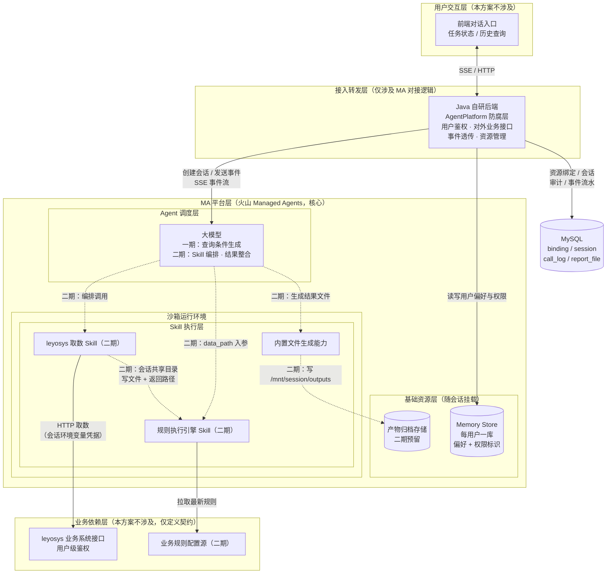

# 火山引擎 Managed Agents 商品异常分析Agent 技术方案
> **版本**：V1.7（评审结论稿）
> **V1.3 修订（历史口径，已被 V1.7 取代）**：① 一期不做分析（规则执行引擎）Skill，诊断分析能力整体后移二期；当时一期链路为「指令理解 → leyosys 取数 Skill → 结果对话/文件交付」。② 明确多 Skill 大数据传递机制（见 3.1.3）：同会话多 Skill 的沙箱本地文件系统不互通、也不能编程互调；大数据经会话共享目录约定路径中转，数据本身不过模型上下文。
> **V1.4 修订**：① 完善 `business_agent_session` 支持「会话升级只读」——新增 `biz_status=2`、`skill_version`、`frozen_reason`、`frozen_at`；② 新增 `agent_event_log` 会话事件流水表，逐事件落库保存消息与工具调用，用于评估/审计。
> **V1.5 修订**：接入层由 Node.js 自研后端改为 **Java 自研后端（火山官方 `ark-runtime` SDK）**；新增 4.0「Java SDK（ark-runtime）对接说明」，并将全文「Node 后端」统一替换为「Java 后端」（Skill 内部的 `Node 子进程` 描述保留，指既有 Skill 实现细节）。
> **V1.6 修订**：技术方案平台解耦。① 对外只暴露业务接口，隐藏平台概念；② 接入层引入 `AgentPlatform` 防腐层，火山为首个实现，预留百炼/腾讯 ADP；③ 四张表加 `platform`/`platform_config`/`config_snapshot`，主键改 UUID，`tool_fee` 单列；④ 移除 Vault/凭据库，统一为「创建会话时注入环境变量」管控 token；⑤ 新增三平台事件映射与规范事件枚举。
> **V1.7 修订**：完成关键评审决策。① 一期不直接取数、不生成文件，改为生成结构化查询条件；② 同一会话任务未结束时直接拒绝，允许创建临时独立会话并行处理，并发状态使用 Redis 锁；③ 依据官方文档确认 `span.model_request_end.model_usage` 字段、Custom Tool 事件与 `requires_action` 续跑机制；④ 审计数据永久保存并直接入库；⑤ 移除预付费成本估算，Managed Agents 按后付费账单口径管理。
> **更新说明**：V1.1 修订：① 一期鉴权改用会话环境变量注入，Vault 调整为二期进阶方案（需同步改造 leyosys/Skill）；② Memory Store 改为每用户独立单库，全局规则改由业务侧配置源实时拉取；③ 修正 SSE 事件语义（custom_tool 前缀、requires_action、file/error 事件），补充单会话并发限制与成本假设出处。V1.7 起，一期不再直接取数、不生成文件，历史留存与数据量约束仅作为二期预留口径。
> **V1.2 修订**：新增 3.7 数据表结构设计（`business_user_agent_binding` / `business_agent_session` / `agent_call_log` / `agent_report_file` 四张表）；历史分析文件索引由 Memory Store 迁至 `agent_report_file` 表，Memory Store 仅保留用户偏好与权限标识。
> **方案边界**：本方案仅覆盖火山引擎 Managed Agents 平台侧的对接设计、Agent 配置、Skill 集成、资源管理、会话与事件处理，不包含 leyosys 业务系统本身、业务规则引擎的后端开发与运维。

---

## 怎么读本文档

- **先看「评审结论清单」**：P0/P1/P2 已确认，P3 属二期 POC。
- **再读「二、整体架构与核心链路」**建立全局；实现细节看三、四，可靠/安全/成本/运维按需看五~八，落地节奏看九。
- **阶段约定**：正文以「一期 / 二期」标注交付阶段；架构图中虚线表示二期能力。

## 评审结论清单（2026-09-16）
> 原待确认项已逐项澄清。P0/P1/P2 结论如下；P3 仍属二期 POC。

### P0：编码前必须确定

#### P0-1 一期文件留存与私有 TOS（已确认）
- **结论**：一期不直接取数、不生成结果文档，因此不做文件落盘，不挂载私有 TOS，不建设归档与清理任务。
- **一期交付**：Agent 仅生成结构化查询条件与解释说明，供用户复制或带到业务系统执行。
- **二期预留**：若后续需要真实取数、分析报告或文件交付，再重新评审文件生命周期与对象存储方案。

#### P0-2 同一 Session 并发请求策略（已确认）
- **结论**：同一会话上一任务未结束时，新消息直接拒绝，返回“上一任务进行中”，不做排队。
- **并行策略**：允许用户创建临时独立会话并行分析；临时会话不继承默认会话上下文，仅复用用户级配置与凭据。
- **实现口径**：并发互斥使用 Redis 锁；锁 key 以 `conversation_id` 为粒度，任务最终态或服务异常时通过 TTL 兜底释放。

### P1：不挡编码，上线前必须验证（字段/事件映射级）

#### P1-1 `span.model_request_end` 的 usage / request_id 字段结构（已核对官方文档）
- **官方字段**：`span.model_request_end` 携带 `model_usage`，字段为 `input_tokens`、`output_tokens`、`cache_creation_input_tokens`、`cache_read_input_tokens`、`speed`。
- **request_id**：官方事件示例未携带 `request_id`；`request_id` 仅出现在通用 API 错误响应示例中，不能作为模型请求粒度对账标识。审计以事件 `id` 与 `model_request_start_id` 关联。
- **累加边界**：从本轮 `user.message` 提交成功开始，到 `session.status_idle` 且 `stop_reason.type != requires_action` 结束；期间每个 `span.model_request_end.model_usage` 均累加到本轮 `agent_call_log`。

#### P1-2 官方会话事件类型清单复核（已核对官方文档）
- **事件域**：官方事件类型遵循 `{domain}.{action}`，包含 User、Agent、Session、Span 域。
- **核心类型**：`user.message`、`user.interrupt`、`user.tool_confirmation`、`agent.message`、`agent.thinking`、`agent.tool_use`、`agent.tool_result`、`agent.mcp_tool_use`、`agent.mcp_tool_result`、`agent.custom_tool_use`、`user.custom_tool_result`、`session.status_running`、`session.status_idle`、`session.status_rescheduled`、`session.status_terminated`、`session.error`、`session.deleted`、`session.updated`、`span.model_request_start`、`span.model_request_end`。
- **其他官方类型**：`user.define_outcome`、`agent.thread_message_sent`、`agent.thread_message_received`、`agent.thread_context_compacted`、`session.thread_created`、`session.thread_status_running`、`session.thread_status_idle`、`session.thread_status_rescheduled`、`session.thread_status_terminated`、`span.outcome_evaluation_start`、`span.outcome_evaluation_ongoing`、`span.outcome_evaluation_end`。一期主链路不依赖这些类型，但适配层需保留未知事件透传与原始落库能力。
- **Custom Tool**：工具调用事件为 `agent.custom_tool_use`；随后 `session.status_idle` 携带 `stop_reason.type=requires_action` 与 `stop_reason.event_ids`，业务侧按 `custom_tool_use_id` 回传 `user.custom_tool_result`，多个阻塞事件建议放在同一 `events` 数组；全部处理完成后 Session 切回 running。
- **任务收口**：仅 `session.status_idle` 且非 `requires_action` 可视为本轮结束；错误原生事件为 `session.error`，接入层归一化为我方 `error`。

### P2：内部业务/商务确认（不阻塞开发）

#### P2-1 审计保留周期（已确认）
- **结论**：`agent_call_log` 与 `agent_event_log` 均直接写入业务数据库，永久保存，不做按月分区到期清理或外部归档删除。
- **治理要求**：按用户、会话、任务维度权限管控；如未来数据量影响查询，可增加只读归档库或索引优化，但默认不删除审计数据。

#### P2-2 成本单价核对（已确认）
- **结论**：删除月度成本估算与 ArkClaw 预付费席位测算；Managed Agents 采用后付费模式，以火山账单为准。
- **技术口径**：`agent_call_log` 保存平台返回的 token、缓存 token、运行时长与原始用量，用于事后与账单核对，不在业务侧预估计费金额。

#### P2-3 超时阈值与口径统一（已确认）
- **一期结论**：一期不调用 leyosys 取数、不涉及分页与单次分页 HTTP 超时；Agent 仅生成查询条件。
- **事件等待**：等待 Agent 事件不设置任务级总硬超时；SSE 依赖断点续传，连接层只处理网络超时与重连。
- **软超时**：可保留“运行时长告警 + 用户可中断”的软超时能力，但不自动终止正常长任务。

### P3：二期 POC（不挡一期）
1. 会话共享目录的挂载形态，以及接近 10MB 单文件的读写实测（3.1.3）；
2. 会话级环境变量注入在百炼/腾讯的等价能力（3.4.1 待验）。

---

## 一、项目概述
### 1.1 背景与目标
基于火山引擎 Managed Agents 构建商品异常分析智能 Agent。一期先落地自然语言到结构化查询条件的生成能力，帮助业务人员准确表达取数与分析意图；二期再接入 leyosys 取数、规则执行与异常诊断能力。

核心建设目标：
1.  一期实现自然语言指令理解、参数澄清与结构化查询条件生成，不直接调用业务取数接口
2.  一期支持同会话任务互斥、临时独立会话并行、事件流转发与审计入库
3.  二期复用 leyosys 自定义 Skill 拉取数据，并建设异常诊断、规则匹配与规则热更新能力；单次单用户原始数据量≤10MB 作为二期约束

### 1.2 建设范围
- ✅ 一期（本版落地）：Agent 编排设计、结构化查询条件生成、会话管理、每用户独立 Memory Store 设计、创建会话时直接注入用户凭据环境变量、Redis 同会话互斥、临时独立会话、SSE 事件对接、审计直接入库。**一期不调用 leyosys 取数 Skill，不做文件交付与 TOS 归档**
- ⏭️ 二期（进阶）：leyosys 真实取数 Skill、分析（规则执行引擎）Skill 与规则配置源热更新（多 Skill 大数据按 3.1.3 会话共享目录模式接入）
- ❌ 不包含：leyosys 业务系统开发、业务规则逻辑本身的研发、前端页面开发、业务侧后端服务

### 1.3 用户与使用模式
- 目标用户：约 1000 名内部业务运营/分析人员
- 触发方式：用户主动发送分析指令触发任务
- 交互形态：单轮完整分析 + 多轮追问细化（如调整维度、重算、补充说明）
- 鉴权粒度：leyosys 业务接口为**用户级独立鉴权**，每个用户凭据隔离；通过创建会话时注入环境变量承载用户 token
- 数据规模：一期不拉取原始业务数据；二期接入取数后，单次单用户原始数据量≤10MB，沙箱内内存处理

### 1.4 核心交付产物
1.  **一期**：结构化查询条件（商品范围、时间、维度、过滤、排序等）与生成说明，通过对话交付
2.  **二期**：真实取数结果、对话式异常诊断结论（异常类型、原因判断、处理建议、依据说明）与结构化分析报告文件（Markdown / Excel）

### 1.5 平台环境与版本说明
1. 本方案按**平台无关核心 + 平台适配器**组织：对外接口、表结构、防腐层、规范事件与火山/百炼/腾讯三家无关；火山方舟 Managed Agents 为首个实现，通过 `AgentPlatform` 适配器接入。
2. 平台兼容范围：火山方舟、阿里百炼 Managed Agents、腾讯云 ADP；本方案一期只落地火山，百炼/腾讯保留映射占位与 POC 待验项。
3. 本方案默认按最低兼容路径设计，确保快速上线；计费按 Managed Agents 后付费账单口径管理。
---

## 二、整体架构与核心链路
### 2.1 总体架构分层
| 层级 | 说明 | 本方案范围 |
|---|---|---|
| 用户交互层 | 前端对话入口、任务状态与历史查询 | 不涉及 |
| 接入转发层 | Java 自研后端 + `AgentPlatform` 防腐层，负责用户鉴权、对外业务接口、事件透传、资源管理 | 仅涉及 MA 对接相关逻辑 |
| **MA 平台层（核心）** | 托管 Agent 平台（火山为首个实现，预留百炼/腾讯 ADP） | ✅ 本方案全覆盖 |
| 业务依赖层 | leyosys 业务系统接口、业务规则配置源 | 不涉及，仅定义对接契约 |

MA 平台层内部拆解：
- **Agent 调度层**：一期大模型推理、指令解析与查询条件生成；二期多 Skill 编排调度与结果整合
- **Skill 执行层**：二期 leyosys 取数 Skill、规则执行引擎 Skill、内置文件生成能力；一期不调用
- **基础资源层**：沙箱运行环境、平台记忆/知识（火山 Memory Store 等，按平台能力映射）；产物归档存储为二期预留

**架构总览（组件与数据流视图）：**



### 2.2 核心 Skill 分工与职责边界
| Skill 名称 | 形态 | 职责 | 输入 | 输出 |
|---|---|---|---|---|
| leyosys 取数 Skill | 沙箱内自定义 Skill（已开发完成，**二期/预留**） | Skill 内部完成鉴权与接口选择，拉取商品数据并按用户隔离 | Agent 提取的业务查询参数（商品范围、时间维度等） | 真实取数结果；二期对接分析 Skill 时：大结果写会话共享目录、返回路径（见 3.1.3）。单用户单次≤10MB |
| 规则执行引擎 Skill（分析 Skill） | 沙箱内自定义 Skill（**二期**，一期不建设） | 加载最新业务规则，执行规则匹配、异常分级、根因诊断 | **入参为取数 Skill 写入共享目录的文件路径**（显式 path 入参）+ 动态规则数据 | 异常诊断结论、根因判断、决策建议、依据明细 |
| Agent 主模型 | 平台内置大模型 | **一期**：指令理解与结构化查询条件生成，不调用取数 Skill、不生成文件；**二期**：Skill 调度、结果整合、多轮对话，多 Skill 时传递共享目录路径 | 用户自然语言指令 | 一期：结构化查询条件与解释；二期：最终文字回复、文件生成指令 |

> **Skill 形态说明**：leyosys 取数 Skill 与规则执行引擎 Skill 均为二期能力，按**沙箱内自定义 Skill**实现，Skill 在沙箱内直接发起 HTTP 请求（取数调 leyosys 接口、规则调业务侧规则接口），不采用 custom_tool 回调 Java 后端的链路。若后续改为回调 Java 后端执行，需切换为 `agent.custom_tool_use` + `requires_action` 事件流。

### 2.3 完整执行主流程
1.  用户发送自然语言分析指令（指定商品范围、时间、异常类型等）
2.  Java 后端校验用户身份，查询对应用户的会话与资源绑定关系
3.  Agent 解析指令，提取结构化查询参数
4.  **【一期】** Agent 基于用户意图生成结构化查询条件（商品范围、时间、维度、排序、过滤条件等）与可解释说明，不调用 leyosys、不拉取商品明细、不生成文件
5.  Java 后端将查询条件与任务事件通过 SSE 推送至前端，并逐事件写入 `agent_event_log`
6.  **【二期，一期不执行】** 调度 leyosys 取数 Skill 拉取真实数据；取数 Skill 将数据写入会话共享目录约定路径并返回路径（见 3.1.3）；Agent 把路径作为显式入参调度规则执行引擎 Skill，Skill 读文件、从业务侧规则配置源拉取全量最新规则（内存处理），执行异常诊断
7.  **【二期，一期不执行】** Agent 整合结果生成诊断结论、建议与必要的文件产物
8.  任务结束，会话进入 idle 状态；一期无原始业务数据与文件残留

### 2.4 对外业务接口（平台无关，前端只认这一套）
> 原则：对外接口不暴露任何平台概念（session_id、平台 event_type、stop_reason、vault、memory_store 等）。`conversation_id` / `task_id` 均为我方生成的 UUID；接入层负责把我方接口翻译到 `AgentPlatform` 的火山/百炼/腾讯实现。

| 接口 | 说明 |
|---|---|
| `POST /conversations` | 创建（或返回已有）业务会话，返回 `conversation_id` |
| `POST /conversations/{conversation_id}/messages` | 发送用户消息，返回 `task_id`（本轮分析任务） |
| `POST /conversations/{conversation_id}/interrupt` | 中断当前轮 |
| `GET /conversations/{conversation_id}/tasks/{task_id}` | 查询本轮任务状态与用量 |
| `GET /conversations/{conversation_id}/files` | 查询历史产物文件列表（**二期预留，一期不启用**） |
| `GET /files/{file_id}/download` | 下载产物文件（**二期预留，一期不启用**） |
| `SSE /conversations/{conversation_id}/events` | 推送**我方规范事件**（见 4.3） |

对外 SSE 事件（我方规范事件，与平台无关）：`user_message` / `message` / `tool_call` / `tool_result` / `approval` / `turn_end` / `error`。

---

## 三、核心模块详细设计
### 3.0 平台适配层（AgentPlatform 防腐层，平台无关）
业务逻辑只依赖 `AgentPlatform` 接口，不直接依赖火山/百炼/腾讯 SDK。火山为第一个实现（见 4.0），百炼/腾讯为后续实现。

```java
public interface AgentPlatform {
    PlatformSession createSession(CreateSessionCmd cmd);           // 挂资源、注入环境变量凭据
    PlatformSession getSession(String platformSessionId);
    void deleteSession(String platformSessionId);

    void sendMessage(String platformSessionId, String text);        // 用户消息
    void sendInterrupt(String platformSessionId);
    void submitToolResult(String platformSessionId, String toolCallId, Object result);

    Flowable<NormalizedEvent> streamEvents(String platformSessionId); // 平台事件 → 规范事件
    List<NormalizedEvent> listEvents(String platformSessionId, String afterEventId);

    Usage getUsage(String platformSessionId, String taskId);         // 归一化用量
    List<ArtifactRef> listArtifacts(String platformSessionId);       // 产物发现
    String downloadArtifact(String fileId);                          // 返回下载地址/内容
}
```

关键抽象：
- `PlatformSession`：`platform` + `platformSessionId` + `platformStatus` + `configSnapshot`。
- `NormalizedEvent`：`platform` + `eventType`（我方规范枚举）+ `eventId` + `seq` + `content` + `rawPayload`。
- `Usage`：`inputTokens / outputTokens / cacheReadTokens / cacheCreationTokens / runningDurationMs / toolCallCount / toolFee`。
- `ArtifactRef`：`fileId` + `fileName` + `size` + `url/path`。
- 凭据抽象 `CredentialProvider`：`injectEnv(Map<String,String> env)`（火山环境变量注入型）或 `resolveCredential(userId)`（百炼/腾讯后端持有型）。
- 产物抽象 `ArtifactStore`：`register / list / download / archive`，屏蔽火山 TOS、百炼 Files、腾讯知识库/附件差异。

### 3.1 自定义 Skill 集成设计
#### 3.1.1 leyosys 取数 Skill
- **阶段定位**：**二期/预留能力**；一期不调用该 Skill，Agent 仅生成查询条件
- **部署形态**：沙箱内本地运行的自定义 Skill，随沙箱启动加载
- **鉴权方式**：通过创建会话时注入该用户的 leyosys 鉴权凭据（会话级环境变量），Skill 内直接读取环境变量调用业务接口。凭据仅在会话创建时注入、运行期不可变，凭据轮换时由后端重建会话加载新凭据
- **数据处理策略**：
  - 单次单用户原始数据量≤10MB，沙箱内存可承载，数据全程在内存中流转处理
  - 不写入沙箱本地持久化文件，避免 IO 开销与数据残留
  - 任务结束后数据随上下文释放，沙箱销毁后完全清除，符合数据安全要求
- **用户隔离**：不同用户会话注入各自的环境变量凭据，沙箱与会话完全隔离，无交叉访问风险
- **超时配置**：二期接入真实取数时，基于 leyosys 接口 P95/P99 实测确定单次 HTTP 超时与分页上限；一期无取数与分页，不设置任务级总硬超时
- **错误约定**：标准化错误码与错误信息，Agent 可根据错误类型给出对应话术

#### 3.1.2 分析规则热更新设计（**二期，随分析 Skill 一起上线；一期不建设**）
##### 设计原则：执行器与规则数据解耦，全量热更新不中断会话
- **规则执行引擎 Skill**：作为稳定的执行器本体，封装规则解析、匹配、计算逻辑，版本迭代频率低
- **规则数据**：独立于 Skill 包，由业务侧集中维护与更新，业务调整即时生效

##### 规则存储与加载方案
采用 **业务侧规则配置源实时拉取** 方案（规则不存 Memory Store），兼顾热更新与每用户库隔离：
1.  **存储位置**：规则数据独立于 Skill 包，由业务侧规则配置源统一维护版本，不写入 Memory Store
2.  **加载方式**：规则执行引擎 Skill 每次执行时，直接调用业务侧规则接口拉取最新全量规则（内存处理，不落地）
3.  **生效时机**：**无需重建沙箱、无需中断在线会话**，每次执行拉最新，全量用户即时生效
4.  **版本管理**：规则带版本号，业务侧保留最近 3 个历史版本；回滚在业务侧配置源完成，Skill 下次执行自然拉取回滚后版本
5.  **降级兜底**：规则接口加载异常时，按 5.1 重试；仍失败则返回明确错误提示，引导用户稍后重试，避免用错误规则产出结论

#### 3.1.3 Skill 间协作机制（一期单 Skill；多 Skill 大数据走会话共享目录）

**一期**：不调用自定义 Skill；Agent 提取意图并生成结构化查询条件，以对话内容交付。Skill 间数据传递、文件导出与大数据协作均为二期能力。

> **二期接入分析 Skill 时的大数据传递机制（已确认）**：
>
> 1. **约束**：同会话多 Skill 之间**不能直接跨沙箱共享本地文件**（各自执行环境的本地文件系统不互通），也不能编程互调，只能由 Agent 编排；
> 2. **禁止**：把完整结果集放进工具返回值经模型上下文传递——10MB 量级（数百万 token）物理上无法过模型；
> 3. **机制：会话共享目录 + 路径参数**：
>    1. 取数 Skill 把结果写入**会话共享目录**的约定路径（如 `/{shared_root}/{task_id}/raw_{接口标识}.{jsonl|xlsx}`，`task_id` 由取数 Skill 自行生成（如 uuid），路径规范在 Skill 契约中固化，格式与分析 Skill 的读取契约对齐）
>    2. 取数 Skill 的返回值只放小载荷：**路径 + 行数/字段/字节数/摘要**
>    3. Agent 取到该路径后，将其作为**显式入参**传给分析 Skill；**分析 Skill 必须定义路径入参（如 `data_path`）来接收并读文件**，不得自行扫目录或猜路径
>    4. 分析 Skill 读文件后在其进程内完成诊断，只把结论返回给 Agent，数据不进模型上下文
> 4. **安全**：路径由 Skill 生成、不由用户输入决定；分析 Skill 对入参路径做前缀校验（必须在共享目录约定前缀内），防路径穿越
> 5. **生命周期**：共享目录文件随会话沙箱生命周期，不作长期留存；二期若需要文件长期留存，再按 3.5 的触发条件重新评审对象存储方案
> 6. **异常**：路径不存在、格式不符或越权 → 分析 Skill 返回标准化错误，由 Agent 重新调取数 Skill 或告知用户；分析 Skill 自身失败则终止诊断，取数文件保留
>
> 【一期不触发】上述机制随二期分析 Skill 验证落地，需 POC 确认会话共享目录的具体挂载形态与单文件大小上限（接近 10MB 的文件实测）。

- 调度模式（二期）：取数 → 路径传递 → 分析，由 Agent 串行编排
- 数据传递：**路径/摘要过模型，完整数据走共享目录文件，不过模型上下文**
- 异常中断：取数失败不再调分析；分析失败则诊断终止，已取数据保留在会话沙箱内，是否归档由二期文件能力决定

### 3.2 会话管理设计
#### 3.2.1 会话复用策略
- **策略**：**一人一会话（one user one session）**，1000 用户对应约 1000 个常驻 session
- **理由**：
  1.  用户主动触发、多轮追问场景多，复用会话保留上下文，提升交互连贯性
  2.  资源（Memory Store、会话环境变量）一次挂载/注入，全程生效，避免重复创建开销；私有 TOS 仅二期文件能力启用后再挂载
  3.  沙箱 30 天无活跃自动回收，闲置用户不产生运行成本
  4.  规则热更新不依赖会话重建，会话长期在线不影响规则生效
- **边界**：同一用户多次分析复用同一会话，不同用户会话完全隔离，数据不互通
- **并发限制（已确认）**：同一 Session 不支持并发发送两条消息（平台约束）。后端基于 Redis 锁以 `conversation_id` 为粒度互斥；锁占用中直接拒绝新消息并返回“上一任务进行中”，不做排队。任务到达最终态后释放锁，异常场景依赖 TTL 兜底释放。
- **临时会话（已确认）**：允许用户创建临时独立会话并行处理；临时会话 `is_default=0`，不继承默认会话上下文，仅复用用户级配置、凭据与权限。

#### 3.2.2 交互模式
- 支持单轮一次性完整分析
- 支持多轮追问：调整分析维度、细化品类、重新计算、补充说明建议
- 上下文保留在平台会话事件流中，无需业务侧存储

#### 3.2.3 中断机制
- 长耗时分析过程中，支持通过 `user.interrupt` 事件中止当前任务
- 中断仅终止当前执行轮次，不销毁沙箱、不删除会话，后续可继续发起新分析

### 3.3 Memory Store 场景化设计
#### 3.3.1 存储内容清单
| 存储项 | 说明 | 更新方 |
|---|---|---|
| 用户分析偏好 | 常用分析维度、默认时间范围、输出格式偏好、默认品类权限 | Java 后端 |
| 历史分析文件索引 | 已迁至 `agent_report_file` 表（见 3.7.4），Memory Store 不再承载文件索引 | Java 后端 |
| 用户权限标识 | 可访问的商品品类、数据范围权限标记 | Java 后端 |

> **不存储**：原始业务明细数据、完整异常清单、规则执行引擎代码、全局业务规则（规则由业务侧配置源承载，见 3.1.2）

#### 3.3.2 读写策略
- **读权限**：沙箱以 `read_only` 模式挂载对应用户的 Memory Store，Skill 运行时仅读取用户配置与权限标识
- **写权限**：统一由 Java 后端通过 Memory Store API 执行写入/更新，Skill 不具备写权限，避免数据篡改
- **更新时机**：用户配置变更、完成新的分析任务时，由后端异步更新对应用户的库

#### 3.3.3 容量与生命周期
- **方案选择**：**每用户一个独立 Memory Store**（1000 用户对应约 1000 个库），会话创建时以 `resources[]` 挂载对应用户库
- **容量规划**：
  - 单用户库条目数：2~3 条（用户偏好、权限标识等），单条 ≤100KB，远低于单库 2000 条上限
  - 文件索引不再占用 Memory Store 空间（由 `agent_report_file` 表承载）
  - 全局规则不占 Memory Store 空间（由业务侧配置源承载）
- **生命周期**：
  - 用户级数据：随用户账号生命周期，离职/失效用户同步清理
  - 文件索引：一期不启用；二期若启用文件产物，由 `agent_report_file` 表承载并按届时确认的生命周期管理
  - 规则数据：生命周期由业务侧配置源管理（保留最近 3 版），与本库解耦

### 3.4 凭据管理设计（去 Vault，统一按会话环境变量注入 token）
#### 3.4.1 三平台实测结论（已核对官方文档）
- **火山**：✅ 创建会话时经 `environment.config.env`（`EnvironmentConfigOverride.env`，`Map<String,String>`）注入环境变量，Skill 沙箱内读取；已由 SDK 源码核实。
- **百炼**：✅ `POST /sessions` 请求体字段 `environment_variables`（object，字符串键值对，**沙箱代码中可直接按名读取**）；响应也会返回 `environment_variables`。已核实。另有 `vault_ids` 字段（本方案不用 Vault）。
- **腾讯 ADP**：⚠️ 无「创建会话注入环境变量」能力，但**多会话/多用户隔离不受影响**——`ConversationId` 由外部传入（UUID，每个用户端会话一个），`VisitorId` 唯一标识用户。有**应用级「参数变量」**（`CreateVariable`，AppId 级，官方示例标题称“创建环境变量”，作用域是应用不是会话）与**对话级 `CustomVariables`**（每次对话传）。→ **per-user token 统一走对话级 `CustomVariables` 随每次对话传**；后端持有型仅作兜底。

结论：**火山、百炼都支持创建会话注入环境变量**；腾讯 ADP 无会话级环境变量，走 `CustomVariables` 或后端持有型。由 `CredentialProvider` 适配。

#### 3.4.2 CredentialProvider 抽象
- **注入型**（火山 / 百炼）：火山写 `environment.config.env`，百炼写 `environment_variables`，随 `createSession` 提交。
- **对话变量型**（腾讯，默认）：token 写入对话请求 `CustomVariables`，随每次对话提交。
- **后端持有型**（兜底）：token 不注入沙箱，取数走 MCP/回调，由后端持 token 调业务接口。

#### 3.4.3 安全边界
- token 仅对当前用户会话可见（环境变量/对话变量），按用户隔离；不向前端暴露，日志/事件流不打印完整 token。
- 最小权限：仅注入业务接口调用所必需的 token。

#### 3.4.4 资源绑定关系
- `business_user_agent_binding`：`user_id ↔ platform ↔ 平台资源引用（platform_config）`
- `business_agent_session`：`user_id ↔ platform ↔ platform_session_id`，默认会话以 `is_default=1` 标识

### 3.5 文件归档存储设计（二期预留；一期不启用）
#### 3.5.1 一期决策
- **不直接取数、不生成结果文档**：Agent 仅生成结构化查询条件，查询条件随会话消息与事件流水保存，不生成 Excel/Markdown 文件。
- **不挂载私有 TOS**：无文件产物时不存在 7 天平台存储或 30 天归档诉求。
- **不建设归档/清理任务**：`agent_report_file` 相关接口与清理逻辑均不启用。

#### 3.5.2 二期触发条件
仅当后续评审确认需要真实取数、分析报告或文件交付时，再确定：
1. 文件是否属于法定留存范围及留存天数；
2. 使用平台默认产物存储（`/mnt/session/outputs` + Files API）还是私有 TOS；
3. 若使用私有 TOS，需验证挂载目录是否注册到 Files API，以及下载权限、生命周期与索引同步方案。

### 3.6 规则内聚与功能解耦设计
#### 3.6.1 核心设计原则
严守两条设计红线：
1. **不修改 Agent 原始主提示词**：主提示词仅保留角色定位、行为边界与工具调用总原则，不写入具体业务规则、判定标准与映射逻辑，保持长期稳定。
2. **不篡改用户原始输入**：用户自然语言输入原样透传，不在后端强行拼接参数或补充内部信息，保证对话历史一致性。

所有业务规则、执行逻辑、实体映射能力全部下沉至自定义 Skill 层，兼顾保密性与独立迭代能力。

#### 3.6.2 规则分层承载
按规则性质分层落地，兼顾保密、稳定与灵活性：

| 规则层级 | 承载形态 | 更新方式 | 迭代频率 |
|---|---|---|---|
| 框架层（行为边界、输出总规范） | 极简系统主提示词 | Agent 配置变更 | 极低 |
| 执行层（分析流程、判定逻辑、方法论） | 分析引擎自定义 Skill | Skill 包版本发布 | 中 |
| 数据层（阈值、分级标准、商品映射） | Skill 内部配置 / Memory Store 加密存储 | Skill 内更新 / API 热更新 | 高 |

核心业务规则全部内聚于 Skill 内部，控制台仅可见 Skill 名称与功能描述，满足高保密要求。

#### 3.6.3 功能解耦与工具拆分
按单一职责原则拆分，功能边界清晰，独立迭代、可复用：
- **查询条件生成（一期）**：由 Agent 主模型完成自然语言理解、参数澄清与结构化查询条件输出
- **leyosys 取数 Skill（二期）**：业务接口数据拉取，鉴权/接口选择在 Skill 内闭环，按用户隔离
- **报告/结果文件生成（二期）**：结构化结果文件输出、格式转换
- **商品信息标准化工具（二期可拆）**：商品名称/别名转标准编码、属性映射与权限校验，基础能力复用
- **分析引擎 Skill（二期）**：规则加载、异常诊断、决策生成，核心业务逻辑唯一承载点；经会话共享目录 `data_path` 入参接收取数结果（见 3.1.3）

二期工具间采用模型统一编排、串行调度模式，**大数据走共享目录文件、路径过模型**，职责边界清晰。

#### 3.6.4 工具调用管控机制
采用「模型自主调度 + 后端边界约束 + Skill 入口校验」三层机制，既保留 Agent 原生编排能力，又确保分析类任务 100% 触发工具。
1. **后端动态边界约束**：所有工具提前注入 Agent 自定义工具列表，由 Agent 自主识别意图、选择工具。后端仅做粗粒度意图分类，通过 `tool_choice` 参数划定边界：分析类请求设为 `required`（强制调用工具，禁止直接回答）；非分析类请求设为 `auto`（模型自主）。
2. **Skill 入口合法性校验**：所有业务工具入口做参数与权限校验，校验不通过返回标准化错误，禁止跳过执行。
3. **后端事件流观测兜底**：SSE 层观测本轮工具调用事件（平台成对稳定下发，见 3.7.0）；若分析类请求至 idle 仍无工具调用记录，**不自动重发消息**（Java 后端不去重、不替用户重入，重复执行由 Agent 侧承担，见 5.2），仅记录异常并提示用户重试，避免重复取数、重复计费与重复产物。

#### 3.6.5 分阶段落地
1. **一期（快速上线）**：只建查询条件生成链路——会话/凭据/Memory Store + Redis 互斥 + 事件/审计入库，最小开发量跑通全链路。
2. **二期（取数与分析能力）**：接入 leyosys 取数 Skill，建设分析引擎 Skill 与规则配置源，按 3.1.3 会话共享目录模式传递取数结果；商品标准化等基础能力按需拆出。
3. **三期（动态优化）**：高频规则抽离至 Memory Store 加密存储，支持热更新。

### 3.7 数据表结构设计（平台无关 · V1.6 修订）
> 设计口径：
> 1. 四张表均带 `platform`（volcano / bailian / tencent_adp）；稳定通用字段做实体列，平台特有字段进 `platform_config JSON`。
> 2. 对外业务主键用 UUID（`conversation_id` / `task_id` / `file_id`），DB 内部保留 `id BIGINT AUTO_INCREMENT` 做 join；平台侧标识存 `platform_*` 列或 JSON。
> 3. `config_snapshot` 为结构化快照（我方配置 hash 为主 + 平台版本辅助），用于会话升级只读判定，见 3.7.2。
> 4. 审计表只存统计维度，不存消息正文、业务明细、规则内容；事件流水逐事件落库。
> 5. 时间统一 `DATETIME(3)`。

#### 3.7.0 字段数据来源核对（火山为首个实现，百炼/腾讯映射见 4.3）
| 字段 | 数据来源 | 火山是否直接提供 | 说明 |
|---|---|---|---|
| platform_session_id | `POST /sessions` 返回的 `id` | ✅ 直接返回 | 4.1 已确认 |
| platform_status / stop_reason | `session.status_*` 事件（idle / running / terminated + stop_reason） | ✅ 直接返回 | 4.2 已确认 |
| config_snapshot | 我方配置 hash 为主 + 平台版本辅助 | ✅（火山 agent_version 已确认） | 会话创建时确定并落 `config_snapshot`；百炼/腾讯的版本字段待 POC 复核，兜底用我方自管 config 版本 |
| tool_call_count | 事件流中的工具调用事件（`agent.tool_use` / `agent.mcp_tool_use` / `agent.custom_tool_use`） | ✅ 直接返回（已确认） | 平台**逐次、稳定、成对下发**，每次工具调用有明确事件与唯一 ID，不丢失、不合并；Java 后端按本轮事件对计数，只落本轮汇总数，不存工具明细 |
| input_tokens / output_tokens / cache_read_tokens / cache_creation_tokens | `span.model_request_end.model_usage` | ✅ 直接返回（已核对官方文档） | 官方字段：`model_usage.input_tokens`、`model_usage.output_tokens`、`model_usage.cache_creation_input_tokens`、`model_usage.cache_read_input_tokens`，另有 `model_usage.speed`；落库映射见 3.7.3。usage 随一轮内每次模型请求分别返回，Java 后端从本轮 `user.message` 提交成功累加至非 `requires_action` 的 `session.status_idle`，最终只落一行汇总。官方事件示例未携带 `request_id`，对账以事件 `id` / `model_request_start_id` 关联 |
| running_duration_ms | 后端观察 running → idle 自行计时 | ❌ 平台不直接给单次时长 | 由 started_at / ended_at 计算，可靠 |
| cost | 后端按账单周期核对（可选） | ❌ 平台不直接给单次费用 | Managed Agents 为后付费，业务侧不预估单次费用；如需成本展示，只能基于账单分摊，不得采信模型返回值 |
| model | 业务侧创建 Agent 时指定，或事件返回 | ✅ 业务侧已知 | 若会话可覆写模型，需记录覆写后的值 |
| error_code / error_msg | `error` 事件（后端归一化） | ⚠️ 事件归一化 | 4.2 已注明 error 为归一化事件，非方舟原生事件名 |
| object_path / 文件归属 | 火山 `GET /files?scope_id&purpose=agent`（已确认）；百炼 Files、腾讯按各自能力 | ✅ 火山直接返回 | 火山 Skill 写 `/mnt/session/outputs` 自动注册为 `purpose=agent`；产物发现统一由 `AgentPlatform.listArtifacts` 抽象，归档对象路径落 `object_path` |

#### 3.7.1 business_user_agent_binding（业务用户-平台资源绑定，用户级）
| 字段 | 类型 | 说明 | 必填 |
|---|---|---|---|
| id | BIGINT | 自增主键 | 是 |
| user_id | VARCHAR(64) | 业务用户 ID | 是 |
| platform | VARCHAR(32) | 平台：volcano / bailian / tencent_adp | 是 |
| platform_config | JSON | 平台资源引用（火山 memory_store_id 等；百炼/腾讯按各自能力） | 否 |
| status | TINYINT | 0 正常 / 1 停用 | 是 |
| created_at | DATETIME(3) | 创建时间 | 是 |
| updated_at | DATETIME(3) | 更新时间 | 是 |

约束：`UNIQUE(user_id, platform)`。默认会话不落这张表，由 `business_agent_session.is_default=1` 判定。

#### 3.7.2 business_agent_session（业务会话映射，会话级）
| 字段 | 类型 | 说明 | 必填 |
|---|---|---|---|
| id | BIGINT | 自增主键 | 是 |
| conversation_id | CHAR(36) | 业务会话 UUID（对外主键，唯一） | 是 |
| user_id | VARCHAR(64) | 业务用户 ID | 是 |
| platform | VARCHAR(32) | 平台 | 是 |
| platform_session_id | VARCHAR(128) | 平台会话 ID | 是 |
| is_default | TINYINT | 1 默认会话 / 0 临时会话 | 是 |
| platform_status | VARCHAR(32) | 平台状态归一化：idle / running / terminated | 是 |
| biz_status | TINYINT | 0 活跃 / 1 已结束 / 2 只读（冻结） | 是 |
| frozen_reason | VARCHAR(128) | 只读原因：config_changed / credential_rotated 等 | 否 |
| frozen_at | DATETIME(3) | 置为只读的时间 | 否 |
| config_snapshot | JSON | 结构化配置快照（我方 config hash + 平台版本辅助） | 否 |
| platform_config | JSON | 平台会话差异字段（火山 agent_id/skill 版本等） | 否 |
| title | VARCHAR(255) | 会话标题/摘要 | 否 |
| created_at | DATETIME(3) | 创建时间 | 是 |
| last_active_at | DATETIME(3) | 最后活跃时间 | 是 |
| terminated_at | DATETIME(3) | 终止时间 | 否 |

约束：`UNIQUE(conversation_id)`；`UNIQUE(platform, platform_session_id)`；`INDEX(user_id, is_default)`。

会话升级只读语义：`biz_status=2` 表示该会话快照已过期（agent/skill 升级或凭据轮换），后端**禁止继续发送普通消息**。判定：每次发消息前，用当前配置重算 `config_snapshot` 与会话快照比对，不一致则置 `biz_status=2` 并写 `frozen_reason`/`frozen_at`。

#### 3.7.3 agent_call_log（调用审计，一次分析任务一行）
| 字段 | 类型 | 说明 | 必填 |
|---|---|---|---|
| id | BIGINT | 自增主键（一轮任务一个，作为审计与文件关联的唯一标识） | 是 |
| task_id | CHAR(36) | 业务任务 UUID（对外主键，唯一） | 是 |
| conversation_id | CHAR(36) | 业务会话 UUID | 是 |
| user_id | VARCHAR(64) | 业务用户 ID | 是 |
| platform | VARCHAR(32) | 平台：volcano / bailian / tencent_adp | 是 |
| platform_session_id | VARCHAR(128) | 平台会话 ID | 否 |
| model | VARCHAR(64) | 模型标识（如 doubao-seed-2.1-turbo） | 否 |
| status | TINYINT | 0 成功 / 1 失败 | 是 |
| error_code | VARCHAR(64) | 错误码 | 否 |
| error_msg | VARCHAR(512) | 错误信息 | 否 |
| input_tokens | INT | 未命中缓存的新增输入 Token（计费输入项） | 否 |
| output_tokens | INT | 模型生成的全部输出 Token（计费输出项） | 否 |
| cache_read_tokens | INT | 命中缓存读取 Token（平台 `cache_read_input_tokens`，单价更低） | 否 |
| cache_creation_tokens | INT | 新增创建缓存 Token（平台 `cache_creation_input_tokens`，缓存存储计费，可选） | 否 |
| total_tokens | INT | 总消耗 Token（`input_tokens + output_tokens + cache_read_tokens`） | 否 |
| tool_call_count | INT | 内置工具调用次数 | 否 |
| tool_fee | DECIMAL(12,6) | 工具 / MCP 调用费（平台差异，可空） | 否 |
| running_duration_ms | INT | 运行时长（毫秒） | 否 |
| cost | DECIMAL(12,6) | 折算费用（后算，可空） | 否 |
| platform_usage | JSON | 平台特有用量/计费原始字段 | 否 |
| started_at | DATETIME(3) | 开始时间 | 是 |
| ended_at | DATETIME(3) | 结束时间 | 否 |

约束：`UNIQUE(task_id)`；`INDEX(user_id, started_at)`；`INDEX(platform, platform_session_id)`。Java 后端不做请求去重——用户每发送一条消息均由 Agent 完整执行并落一行记录，重复提交由 3.2.1 的同会话并发限制兜底。三平台统一用量模型：token 五列 + `running_duration_ms` + `tool_call_count` + `tool_fee`；平台计费差异（如百炼 MCP 费、腾讯 PU）进 `platform_usage`，`cost` 由后端按平台单价汇总回算。

#### 3.7.4 agent_report_file（报告文件索引；二期预留，一期不启用）
| 字段 | 类型 | 说明 | 必填 |
|---|---|---|---|
| id | BIGINT | 自增主键 | 是 |
| file_id | CHAR(36) | 业务文件 UUID（对外主键，唯一） | 是 |
| call_log_id | BIGINT | 关联 `agent_call_log.id`（本轮任务） | 是 |
| conversation_id | CHAR(36) | 业务会话 UUID | 是 |
| user_id | VARCHAR(64) | 业务用户 ID | 是 |
| platform | VARCHAR(32) | 平台 | 是 |
| file_type | VARCHAR(16) | 文件类型（md/xlsx） | 否 |
| file_name | VARCHAR(255) | 文件名 | 否 |
| object_path | VARCHAR(512) | 归档对象路径（我方 OSS/TOS） | 是 |
| platform_config | JSON | 平台文件引用（火山 file_id / 百炼 file_id / 腾讯引用） | 否 |
| file_size | INT | 文件字节数 | 否 |
| status | TINYINT | 0 有效 / 1 已过期删除 | 是 |
| expire_at | DATETIME(3) | 到期时间（二期启用文件能力时定义） | 是 |
| created_at | DATETIME(3) | 创建时间 | 是 |

约束：`UNIQUE(file_id)`；`INDEX(conversation_id, created_at)`；`INDEX(expire_at)`；`INDEX(call_log_id)`。一期不生成文件、不写入该表、不启用文件接口与生命周期任务；表结构保留供二期文件能力复用。二期若启用，文件登记经 `AgentPlatform.listArtifacts` 抽象：火山走 `GET /files?scope_id&purpose=agent`，百炼走 Files API，腾讯按其能力；归档统一到自有对象存储写 `object_path`，平台文件引用进 `platform_config`。

#### 3.7.5 agent_event_log（会话事件流水，评估/审计用）
> 用途：完整保存一轮会话的原始事件（用户消息、助手消息、工具调用与结果、状态变化），供事后评估、质量分析、复现与审计。与 `agent_call_log` 的差异：`agent_call_log` 是**按轮聚合**的统计行（成本/用量），本表是**按事件**的流水（保真时序）。

| 字段 | 类型 | 说明 | 必填 |
|---|---|---|---|
| id | BIGINT | 自增主键 | 是 |
| platform | VARCHAR(32) | 平台 | 是 |
| platform_session_id | VARCHAR(128) | 平台会话 ID | 是 |
| conversation_id | CHAR(36) | 业务会话 UUID | 是 |
| task_id | CHAR(36) | 业务任务 UUID | 否 |
| call_log_id | BIGINT | 关联 `agent_call_log.id`（本轮任务；先到的事件可后回填，可空） | 否 |
| event_id | VARCHAR(128) | SSE 事件 id（断点续传去重用，可空） | 否 |
| seq | BIGINT | 会话内单调递增序号（事件到达顺序） | 是 |
| event_type | VARCHAR(64) | **我方规范事件**：user_message / message / tool_call / tool_result / approval / turn_end / error | 是 |
| role | VARCHAR(16) | user / assistant / tool（可空） | 否 |
| content | JSON | 结构化内容（文本、工具名、参数、结果摘要等） | 否 |
| raw_payload | JSON | 原始事件完整 JSON（保真，评估复现用） | 是 |
| recorded_at | DATETIME(3) | 后端落库时间 | 是 |

约束：`UNIQUE(platform, platform_session_id, event_id)`（event_id 非空时）；`INDEX(conversation_id, seq)`；`INDEX(task_id)`。

**记录时机（关键）**：见 4.2 及官方「流式获取会话事件（SSE）」「Session 事件流总览」。
- **逐事件落库，不等轮次结束**。助手文本会以 delta 流式推送，工具调用是长程调用（先工具开始、很久后才返回结果），只有在每个 SSE 事件到达时立即 append，才能保留真实时序与中间状态。
- 断线重连用 SSE `id`（`Last-Event-ID`）幂等去重，避免重复落库。
- `call_log_id` 关联：Java 后端在发送 `user.message` 前先插入 `agent_call_log` 拿到自增 id，随后本轮所有事件回填该 id，直到 `session.status_idle`（非 `requires_action`）结束本轮。
- 不建议在 `status_idle` 后一次性批量落库：会丢失工具调用中间态、无法还原长程调用时序，也不利于评估“工具调用是否成功/参数是否正确”。

#### 3.7.6 建表 SQL（MySQL 8，参考）
```sql
CREATE TABLE business_user_agent_binding (
  id BIGINT UNSIGNED AUTO_INCREMENT PRIMARY KEY,
  user_id VARCHAR(64) NOT NULL,
  platform VARCHAR(32) NOT NULL,
  platform_config JSON NULL,
  status TINYINT NOT NULL DEFAULT 0,
  created_at DATETIME(3) NOT NULL DEFAULT CURRENT_TIMESTAMP(3),
  updated_at DATETIME(3) NOT NULL DEFAULT CURRENT_TIMESTAMP(3) ON UPDATE CURRENT_TIMESTAMP(3),
  UNIQUE KEY uk_user_platform (user_id, platform)
) ENGINE=InnoDB DEFAULT CHARSET=utf8mb4;

CREATE TABLE business_agent_session (
  id BIGINT UNSIGNED AUTO_INCREMENT PRIMARY KEY,
  conversation_id CHAR(36) NOT NULL,
  user_id VARCHAR(64) NOT NULL,
  platform VARCHAR(32) NOT NULL,
  platform_session_id VARCHAR(128) NOT NULL,
  is_default TINYINT NOT NULL DEFAULT 0,
  platform_status VARCHAR(32) NOT NULL DEFAULT 'idle',
  biz_status TINYINT NOT NULL DEFAULT 0 COMMENT '0 活跃 / 1 已结束 / 2 只读(冻结)',
  frozen_reason VARCHAR(128) NULL,
  frozen_at DATETIME(3) NULL,
  config_snapshot JSON NULL,
  platform_config JSON NULL,
  title VARCHAR(255) NULL,
  created_at DATETIME(3) NOT NULL DEFAULT CURRENT_TIMESTAMP(3),
  last_active_at DATETIME(3) NOT NULL DEFAULT CURRENT_TIMESTAMP(3),
  terminated_at DATETIME(3) NULL,
  UNIQUE KEY uk_conversation (conversation_id),
  UNIQUE KEY uk_platform_session (platform, platform_session_id),
  KEY idx_user (user_id),
  KEY idx_user_default (user_id, is_default)
) ENGINE=InnoDB DEFAULT CHARSET=utf8mb4;

CREATE TABLE agent_call_log (
  id BIGINT UNSIGNED AUTO_INCREMENT PRIMARY KEY,
  task_id CHAR(36) NOT NULL,
  conversation_id CHAR(36) NOT NULL,
  user_id VARCHAR(64) NOT NULL,
  platform VARCHAR(32) NOT NULL,
  platform_session_id VARCHAR(128) NULL,
  model VARCHAR(64) NULL,
  status TINYINT NOT NULL DEFAULT 0,
  error_code VARCHAR(64) NULL,
  error_msg VARCHAR(512) NULL,
  input_tokens INT NULL,
  output_tokens INT NULL,
  cache_read_tokens INT NULL,
  cache_creation_tokens INT NULL,
  total_tokens INT NULL,
  tool_call_count INT NULL,
  tool_fee DECIMAL(12,6) NULL,
  running_duration_ms INT NULL,
  cost DECIMAL(12,6) NULL,
  platform_usage JSON NULL,
  started_at DATETIME(3) NOT NULL,
  ended_at DATETIME(3) NULL,
  UNIQUE KEY uk_task (task_id),
  KEY idx_user_time (user_id, started_at),
  KEY idx_platform_session (platform, platform_session_id)
) ENGINE=InnoDB DEFAULT CHARSET=utf8mb4;

CREATE TABLE agent_report_file (
  id BIGINT UNSIGNED AUTO_INCREMENT PRIMARY KEY,
  file_id CHAR(36) NOT NULL,
  call_log_id BIGINT UNSIGNED NOT NULL,
  conversation_id CHAR(36) NOT NULL,
  user_id VARCHAR(64) NOT NULL,
  platform VARCHAR(32) NOT NULL,
  file_type VARCHAR(16) NULL,
  file_name VARCHAR(255) NULL,
  object_path VARCHAR(512) NOT NULL,
  platform_config JSON NULL,
  file_size INT NULL,
  status TINYINT NOT NULL DEFAULT 0,
  expire_at DATETIME(3) NOT NULL,
  created_at DATETIME(3) NOT NULL DEFAULT CURRENT_TIMESTAMP(3),
  UNIQUE KEY uk_file (file_id),
  KEY idx_call_log (call_log_id),
  KEY idx_conv_time (conversation_id, created_at),
  KEY idx_expire (expire_at)
) ENGINE=InnoDB DEFAULT CHARSET=utf8mb4;

CREATE TABLE agent_event_log (
  id BIGINT UNSIGNED AUTO_INCREMENT PRIMARY KEY,
  platform VARCHAR(32) NOT NULL,
  platform_session_id VARCHAR(128) NOT NULL,
  conversation_id CHAR(36) NOT NULL,
  task_id CHAR(36) NULL,
  call_log_id BIGINT UNSIGNED NULL,
  event_id VARCHAR(128) NULL,
  seq BIGINT NOT NULL,
  event_type VARCHAR(64) NOT NULL,
  role VARCHAR(16) NULL,
  content JSON NULL,
  raw_payload JSON NOT NULL,
  recorded_at DATETIME(3) NOT NULL DEFAULT CURRENT_TIMESTAMP(3),
  UNIQUE KEY uk_event (platform, platform_session_id, event_id),
  KEY idx_conv_seq (conversation_id, seq),
  KEY idx_task (task_id)
) ENGINE=InnoDB DEFAULT CHARSET=utf8mb4;
```

#### 3.7.7 生命周期与清理
- 会话：`business_agent_session.last_active_at` 超过阈值置 `biz_status=1` 或归档；配置升级置 `biz_status=2`（只读）而非删除，保留历史可查；用户离职同步清理。
- 审计（已确认）：`agent_call_log` 永久保存，直接写入业务数据库，不做按月到期清理或外部归档删除。
- 事件流水（已确认）：`agent_event_log` 永久保存，直接写入业务数据库；因含原始事件 payload，需权限管控与脱敏，可通过索引或只读副本优化查询。
- 文件：一期不启用；二期如启用文件产物，再按届时确认的留存策略清理对象存储并同步 `agent_report_file.status`。
---

## 四、接口与事件规范

### 4.0 Java SDK（ark-runtime）对接说明
> 接入层采用火山方舟 Managed Agents 官方 Java SDK **`ark-runtime`**（V3 接口体系），替代原 Node.js 手写 HTTP 实现。下述类名/方法名已通过 `ark-runtime 0.6.0`（2026-09-09 Maven Central 最新版）反编译核实；版本升级后以 [Maven Central](https://central.sonatype.com/artifact/com.volcengine/ark-runtime) 及官方 SDK 文档为准。

#### 4.0.1 依赖坐标
**Maven**
```xml
<dependency>
    <groupId>com.volcengine</groupId>
    <artifactId>ark-runtime</artifactId>
    <version>0.6.0</version>
</dependency>
```
**Gradle**
```gradle
implementation "com.volcengine:ark-runtime:0.6.0"
```
> 源码仓库为 [volcengine/ark-runtime-java](https://github.com/volcengine/ark-runtime-java)（`<scm>` 已核实）。旧包名 `volcengine-java-sdk-ark-runtime`（位于 `volcengine/volcengine-java-sdk` 仓库）为旧版，不推荐新项目使用。

#### 4.0.2 核心入口类
- 平台 API（Agent/Environment/Session/Event/File/Memory/Skill/模型）：`com.volcengine.ark.runtime.service.ArkService`（其接口为 `ArkApi`，基于 Retrofit2 + RxJava，多数方法返回 `io.reactivex.Single<T>`，流式为 `retrofit2.Call<ResponseBody>`）。
- 自托管自定义工具 Worker：`com.volcengine.ark.runtime.selfhosted.SelfHostedClient`。

#### 4.0.3 接口方法映射（原 Node 手写 HTTP → Java SDK）
| 能力 | 实际 SDK 方法（ArkService / ArkApi） | 说明 |
|---|---|---|
| 创建会话 | `createSession(CreateSessionRequest, headers)` → `Single<Session>` | `agent` 用 `AgentIdentifier`；一期 `resources` 仅挂 Memory Store，私有 TOS 二期按需挂载；**用户凭据注入在 `environment.config.env`**（`EnvironmentConfigOverride.env` 的 `Map<String,String>`），非顶层字段 |
| 查询 / 更新 / 删除会话 | `getSession(id)` / `updateSession(id, UpdateSessionRequest)` / `deleteSession(id)` | **无 `terminateSession`**，归档/清理用 `deleteSession`（或按平台语义 `updateSession`） |
| 发送用户事件（消息 / 中断 / 工具结果） | `sendSessionEvents(sessionId, SendSessionEventsRequest, headers)` → `Single<SendSessionEventsResponse>` | **无 `sendMessage`**；`SendSessionEventsRequest.events` 为 `List<ManagedAgentsEventParams>`，分别用 `ManagedAgentsUserMessageEventParams` / `ManagedAgentsUserInterruptEventParams` / `ManagedAgentsUserCustomToolResultEventParams` 提交 |
| 订阅会话事件流（SSE） | `streamSessionEvents(sessionId, headers)` → `Call<ResponseBody>` | 返回原始响应体，需自行解析 SSE 帧 |
| 会话事件历史 | `listSessionEvents(sessionId, ...)` | 断线补偿 / 回溯 |
| 会话资源挂载 | `createSessionResource(sessionId, CreateSessionResourceRequest)` / `listSessionResources(sessionId)` | 运行时挂/卸文件 |
| 文件 | `uploadFile(...)` / `retrieveFile(id)` / `listFiles(...)` / `deleteFile(id)` | 产物发现与分发 |
| Agent | `createAgent(...)` / `getAgent(id)` / `updateAgent(...)` / `deleteAgent(id)` / `listAgentVersions(id)` | Agent 生命周期与版本 |
| Environment | `createEnvironment(...)` / `getEnvironment(id)` / `updateEnvironment(...)` / `deleteEnvironment(id)` | 沙箱环境 |
| Memory Store | `createMemoryStore(...)` / `createMemory(...)` / `listMemories(...)` / `updateMemory(...)` / `deleteMemory(...)` | 每用户记忆库 |
| Skill | `createSkill(...)` / `getSkill(id)` / `openSkillContent(id, ...)` | 自定义 Skill 包 |
| 模型推理（通用） | `createResponse(ResponsesRequest, ...)` / `streamResponse(...)` | 与普通在线推理共用 |

> 说明：原初稿中的 `sendMessage`、`postCustomToolResult`、`terminateSession` 均不存在，已按 SDK 实际签名改为上表方法。

#### 4.0.4 SSE 事件监听
SDK 提供 `streamSessionEvents(sessionId)` 返回 Retrofit `Call<ResponseBody>`，但**不负责解析 SSE 帧**；接入层基于 OkHttp（SDK 底层依赖）解析响应体中的 `text/event-stream`：
- 端点由 SDK 封装（等价 `{baseUrl}/sessions/{sessionId}/events/stream`），Header `Authorization: Bearer {apiKey}`；
- 监听并分发 `agent.message`、`span.model_request_end`、`session.status_running`、`session.status_idle`、`session.error`、二期回调链路的 `agent.custom_tool_use` 等事件（见 4.2）；
- 断线重连用 SSE `id` / `Last-Event-ID` 续传；历史补偿用 `listSessionEvents`；事件去重由 `agent_event_log.event_id` 唯一约束兜底。

#### 4.0.5 自定义工具两条路径
1. **一期：无自定义工具调用**——Agent 主模型仅生成结构化查询条件，后端经 `ArkService` 管理会话、`sendSessionEvents` 发消息、`streamSessionEvents` 监听事件。
2. **二期：沙箱内自定义 Skill**（leyosys 取数，已在 Skill 内闭环鉴权/取数）——不走 `SelfHostedClient`，Skill 在沙箱内直连 leyosys。
3. **二期/回调链路：自托管 Worker（`SelfHostedClient`）**——当工具需由业务后端执行（如分析 Skill 改为 custom_tool）时启用。其核心接口为 `pollWork` / `ackWork` / `heartbeatWork` / `stopWork`（领取与确认工单）、`sendEvent` / `openEventStream`（收发会话事件）、`Tool.execute(input, ToolContext)`（业务工具实现）；**回传结果走 `sendEvent` / `sendSessionEvents` 的 `user.custom_tool_result` 事件，无 `postCustomToolResult` 方法**。

#### 4.0.6 Token 用量累计
- 一轮任务内每次模型请求由 `span.model_request_end` 事件返回 usage（input / output / cache_read / cache_creation）；
- 后端在轮内累加 N 次 usage，轮次结束（`session.status_idle`，非 `requires_action`）写入 `agent_call_log` 一行汇总（见 3.7.3）。

#### 4.0.7 关键模型字段（已反编译核实，编码时直接对应）
- **凭据注入**：`CreateSessionRequest.environment`（`EnvironmentWithOverrides`）→ `.config`（`EnvironmentConfigOverride`）→ `.env(Map<String,String>)`，对应一期「会话环境变量注入用户凭据」；`EnvironmentConfigOverride` 另含 `packages` / `networking` / `setupScript` / `tos`。
- **资源挂载**：`CreateSessionRequest.resources` 为 `List<SessionResource>`；`SessionResource` 支持 `type`（file / memory_store / tos 等）、`memoryStoreId`、`fileId`、`access`（只读/读写）、`mountPath`、`tosBucket` / `tosKey` / `tosRegion`。据此：一期 Memory Store 用 `type=memory_store + memoryStoreId + access=read_only`；私有 TOS 仅二期文件能力启用后再挂载。
- **会话事件提交**：`SendSessionEventsRequest.events` 为事件参数列表，一期实际用到 `ManagedAgentsUserMessageEventParams`（发用户消息）、`ManagedAgentsUserInterruptEventParams`（中断）；二期 custom tool 回传用 `ManagedAgentsUserCustomToolResultEventParams`。
- **事件流解析**：`streamSessionEvents` 返回原始 `ResponseBody`，事件对象含 `ManagedAgentsStartEvent` / `ManagedAgentsDeltaEvent` / `ManagedAgentsSessionEvent` 等，接入层按事件 `type` 分发（具体事件枚举以 SDK 当前版本为准，仍需与 4.2 的实测事件名对齐）。

### 4.1 平台侧核心 API 清单（Java 后端调用）
| 类别 | 接口 | 用途 |
|---|---|---|
| 资源管理 | 创建 Memory Store、写入/删除记忆条目 | 用户配置、权限标识管理（每用户一库） |
| 会话管理 | 创建 Session | 挂载用户 Memory Store，注入用户凭据环境变量；一期不挂载私有 TOS |
| 会话管理 | 发送用户事件 | 提交分析指令、中断任务 |
| 事件流 | SSE Stream 接口 | 监听消息、模型用量、状态与二期 Skill 调用等事件 |
| 文件管理 | 获取文件下载链接 | 二期文件能力预留，一期不启用 |


### 4.2 SSE 核心事件类型与处理逻辑
> 本节为**火山适配器**视角的平台事件；接入层需把它们归一化为 4.3 的我方规范事件后再对外推送与落库。

| 事件类型 | 触发时机 | 处理逻辑 |
|---|---|---|
| `agent.message` | Agent 生成文字回复 | 增量推送至前端 |
| `span.model_request_end` | 单次模型请求结束 | 解析 `model_usage` 四类 token 与 `speed`，按本轮边界累加至 `agent_call_log`；以事件 `id` / `model_request_start_id` 保留审计关联 |
| `session.status_running` | Session 开始或恢复执行 | 更新任务运行状态，开始/继续运行时长观察 |
| `session.status_idle`（`requires_action`） | 等待 custom tool 回传结果 | **不算本轮结束**，回传 `user.custom_tool_result` 后继续；一期沙箱 Skill 场景一般不触发 |
| `session.status_idle`（真正空闲） | 本轮分析任务结束 | 标记任务完成、停止计时、异步更新索引 |
| `agent.custom_tool_use` | custom tool 开始执行（二期/回调链路） | 记录日志、前端展示执行状态 |
| `session.error` | 平台返回不可恢复错误 | 记录原始错误并归一化为我方 `error` 事件，标记任务失败 |

> 说明：① 事件类型以官方「Session 事件流」与「流式获取会话事件」文档为准，事件名遵循 `{domain}.{action}`；② Custom Tool 事件为 `agent.custom_tool_use`，`requires_action` 期间需按 `custom_tool_use_id` 回传 `user.custom_tool_result`，多个阻塞事件建议放入同一 `events` 数组；③ 一期无文件产物，不调用 Files API 轮询；二期若启用文件交付，产物文件在 `session.status_idle` 后通过 Files API 获取：Skill 写入沙箱 `/mnt/session/outputs` 目录的文件会自动注册为 `purpose=agent`，必须显式带 `scope_id={session_id}&purpose=agent`；④ 后端向前端透出的 `error` 为归一化事件，火山原生错误事件为 `session.error`。

### 4.3 我方规范事件与三平台映射（平台无关）
| 我方规范事件 | 火山方舟 | 阿里百炼 | 腾讯 ADP（HTTP SSE） |
|---|---|---|---|
| `user_message` | `user.message` | `message`(role=user) | 请求侧 `POST /chat`（`request_ack` 为回执） |
| `message` | `agent.message` | `message`(role=assistant) | `text.delta` / `text.replace` / `message.added`(Type=reply) |
| `tool_call` | `agent.tool_use` / `agent.custom_tool_use` | `tool_call` / `mcp_call` | `message.added`(Type=tool_call, Status=processing) |
| `tool_result` | `agent.tool_result` / `user.custom_tool_result` | `tool_call_output` / `mcp_call_output` | tool_call 消息 Status=success/failed，输出在 Contents |
| `approval` | `session.status_idle`(requires_action) | `tool_approval_request` / `tool_approval_response` | `message.added`(Type=questionnaire)，作答走新请求 |
| `turn_end` | `session.status_idle`(非 requires_action) | `session_status`(null/end_turn/retries_exhausted) | `response.completed` / `done` |
| `error` | `session.error`（归一化） | `error` | `error` |

> 注意：approval 的裁决回传方式三平台不同（火山同会话续跑、百炼 `tool_approval_response`、腾讯新请求），防腐层需抽象「交互型事件 + 续跑/裁决」，不能只做字段名映射。

---

## 五、可靠性与异常处理
### 5.1 核心异常场景与处理
| 异常场景 | 触发原因 | 处理策略 |
|---|---|---|
| 同会话并发冲突 | Redis 锁显示上一任务未结束 | 直接拒绝新消息，返回“上一任务进行中”；如需并行，引导创建临时独立会话 |
| 查询条件生成失败 | 用户意图不完整、缺少必要参数、模型输出不符合 Schema | 返回澄清问题或参数缺失提示，不生成部分条件 |
| 模型调用失败 | 限流、服务异常 | 重试 1 次；仍失败则返回友好提示，记录告警 |
| SSE 连接断开 | 网络波动、代理超时 | 自动重连 + `Last-Event-ID` 断点续传，不丢失事件，用户无感知 |
| 运行时长偏长 | 任务运行超过软阈值 | 仅告警并保留用户中断入口，不自动终止任务 |
| 二期：取数 Skill 鉴权失败 | 用户凭据过期、权限变更 | 返回鉴权失败提示，引导重新认证；触发会话重建加载新凭据 |
| 二期：取数 Skill 执行失败 | 接口超时、参数错误、数据为空 | 返回明确错误话术，提示用户检查查询条件；数据为空时给出空值说明 |
| 二期：数据量超限 | 单次取数超过10MB阈值 | 提示用户缩小查询范围，分批分析；避免沙箱内存溢出 |

### 5.2 重试与重复提交
- **重试策略**：模型调用失败重试 1 次；二期真实取数接口再基于 P95/P99 实测确定指数退避次数与单次 HTTP 超时
- **重复提交**：Java 后端不做请求级幂等去重，用户每发送一条消息都由 Agent 完整执行；`agent_call_log` 以自增 `id` 按轮记账。同一会话并发由 Redis 锁直接拒绝，避免平台侧并发报错；SSE 断连重连只续传事件，不产生新任务行
- **断点续传**：SSE 事件流支持 `Last-Event-ID`，断连重连后从断点继续，不重复推送

---

## 六、安全与合规
### 6.1 凭据安全
- 一期：用户凭据经会话环境变量按用户隔离注入，仅沙箱内可读，不向前端暴露，日志/事件流不打印完整凭据
- 凭据定期轮换，轮换后重建会话加载新凭据，留存更新审计记录

- 最小权限原则：仅注入业务接口调用所必需的凭据

### 6.2 数据安全
- 一期不调用业务取数接口，不产生原始商品明细数据；用户指令、生成条件与事件流水按审计要求直接入库
- Memory Store 仅存用户配置与权限标识，不存储原始业务明细数据与规则数据
- 一期不挂载私有 TOS、不生成文件；二期若启用文件能力，再补充对象存储加密、访问权限与生命周期策略
- 不同用户会话、沙箱、资源完全隔离，数据不互通

### 6.3 审计追溯
- 所有任务执行均有完整会话事件日志；二期 Skill 调用与文件生成同样逐事件落库
- 支持按 `session_id`、`user_id` 追溯完整执行链路与操作记录
- 规则更新、凭据更新均留存操作日志，可审计

---

## 七、成本与资源治理
### 7.1 计费模式（已确认）
- Managed Agents 采用**后付费**模式，费用以火山账单为准，本方案不做月度预估计费表，不引入 ArkClaw 预付费席位测算。
- `agent_call_log` 记录 `input_tokens`、`output_tokens`、`cache_read_input_tokens`、`cache_creation_input_tokens`、`running_duration_ms` 与 `platform_usage`，用于账单核对与异常用量分析。
- 不在任务实时链路中计算费用，避免因单价、缓存折扣或账单口径变化导致业务侧成本数据失真。


### 7.2 成本优化策略
1. **模型分层**：简单查询条件生成用轻量模型，复杂多轮澄清再用更强模型
2. **闲置回收**：依赖平台 30 天不活跃沙箱自动回收机制，降低无效运行时长
3. **任务优化**：一期仅生成查询条件，不拉取明细，天然降低模型 token 与沙箱运行时长
4. **账单核对**：按月导出火山账单，与 `agent_call_log` 聚合指标比对，发现异常用量

### 7.3 资源生命周期管理
- **用户维度**：用户离职/失效时，停用平台资源并保留审计数据；如需清理 Memory Store 与历史会话，须先完成合规审批
- **会话维度**：长期闲置会话保留 session 对象，沙箱自动回收，不产生费用
- **文件维度**：一期无文件产物；二期启用后再定义生命周期
- **规则维度**：业务侧配置源保留最近 3 版规则，历史版本定期清理

---

## 八、运维与可观测性
### 8.1 日志体系
- 会话事件日志：平台原生完整事件流，用于全链路排查
- Skill 执行日志：二期启用 Skill 后，通过沙箱内标准输出定位报错
- 接入层日志：Java 后端请求、SSE 连接、重连、错误、并发锁与事件解析日志

### 8.2 核心监控指标
- 业务指标：在线会话数、日任务量、任务成功率、平均响应时长
- 资源指标：沙箱运行时长、Token 消耗量、缓存命中量；二期增加文件生成量与对象存储用量
- 异常指标：错误率、SSE 重连次数、并发拒绝率、鉴权失败率；二期增加 Skill 失败率
- 规则指标：二期启用规则配置源后监控更新频率、加载成功率、版本分布

### 8.3 排障路径
1.  按 `session_id` 拉取完整会话事件流，定位失败节点
2.  核对 Memory Store 资源挂载与权限配置，以及会话环境变量注入
3.  二期启用 Skill 后，查看对应 Skill 执行日志，定位代码/参数/接口问题
4.  核查模型调用与限流情况
5.  规则异常时核对业务侧规则配置源的版本与内容

---

## 九、方案落地实施建议
1.  **一期优先落地核心链路**：用户会话管理 + 每用户 Memory Store + 会话环境变量凭据 + Agent 生成结构化查询条件 + Redis 同会话互斥 + 临时独立会话 + 事件/审计直接入库，验证主流程通畅；**不调用 leyosys 取数 Skill，不做文件交付与 TOS 归档**
2.  **二期扩展能力**：leyosys 真实取数 Skill、分析引擎 Skill（会话共享目录 `data_path` 接入，见 3.1.3）+ 规则热更新（业务侧配置源实时拉取）、精细化权限、历史查询与归档管理
3.  **灰度验证**：先小范围用户试点，验证性能、成本、稳定性后全量推广
4.  **预案准备**：提前准备平台异常降级方案，核心业务场景配置备用调用路径

---

## [参考文档](./managed-agent-docs.md)
